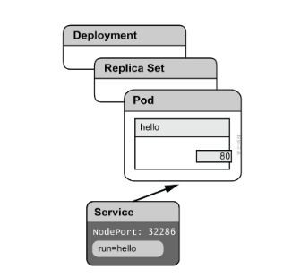
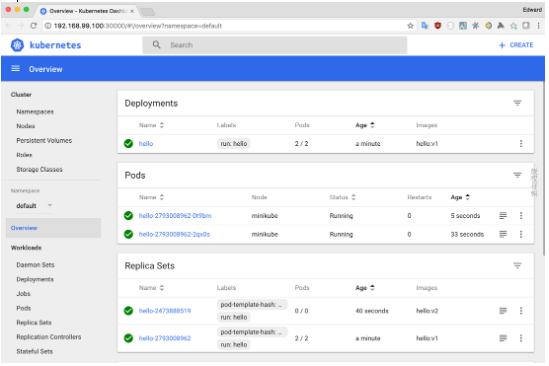
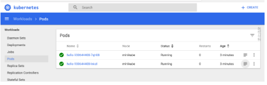
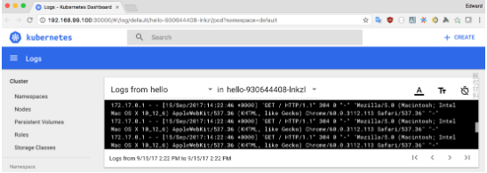
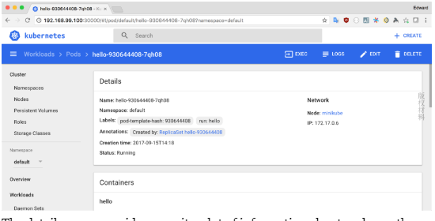
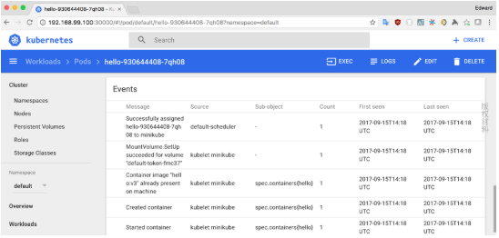
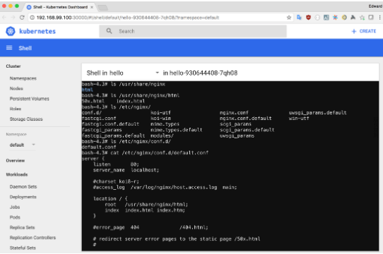

# 启动你的引擎

在本章中，我们将采用 Kubernetes 的第一步。您将学习如何在自己的工作站上启动适合学习和开发的集群，并将开始学习如何使用 Kubernetes。在本章中，我们将执行以下操作：
* 了解如何安装和使用 Minikube 运行 Kubernetes
* 构建在 Docker 容器中运行的简单应用程序
* 使用Kubernetes运行简单的应用程序


##  1 你自己的 Kubernetes

**Minikube** 是一个可以在您的工作站上轻松运行简单的 Kubernetes 集群的工具。它非常有用，因为它允许您在本地测试应用程序和配置，并快速迭代应用程序，而无需访问更大的群集。出于我们的目的，它是获得Kubernetes实践经验的理想工具。它最大的优势就是安装和配置非常简单。

### 安装

在你的工作站中，你需要一些工具来帮助你使用Kubernetes

1.  **kubectl** 是 Kubernetes 的cli(命令行接口)，在本书中你尽量使用它和 Kubernetes 进行交互

1.  **minikube** 是一个在本地计算机上管理的Kubernetes 的命令，它可以处理所有的难题。

1. **docker** minikube的虚拟机，内部运行docker的守护程序，但如果要直接与工作站进行交互，则可能需要在工作站上安装Docker命令行。


最好将Minikube与虚拟机结合使用，因为像 macOS 和 Windows 这样的平台本身不支持Linux容器，甚至在Linux上也有助于保持环境的清洁和隔离。您可以使用各种虚拟化工具与minikube一起使用，具体取决于您的操作系统：
 
* VirtualBox：它易于使用，可以安装在macOS上，Windows 和 Linux。
* VMware Fusion：它是macOS上提供的商业工具。
* KVM：它是一个着名的Linux虚拟化工具。 
* xhyve：这是一个利用macOS中的本机管理程序框架的开源项目。它表现非常好，但安装和使用起来可能有点困难。
* Hyper-V：它是Windows的本机虚拟化工具。请记住，您可能需要在计算机上手动启用它并设置其网络。

在本书中，我们将介绍默认选项 VirtualBox，但如果您经常使用 Minikube ，则可能需要探索其他一些选项，因为如果设置正确，它们可以提高性能和可靠性。您可以在[git.k8s.io](https://git.k8s.io/minikube/docs/drivers.md) 找到有关不同驱动程序的一些文档。

#### macOS

在 Mac 中最好的安装 **minikube**和 **kubectl** 方法是使用 Homebrew 

tip: 用于 macOS 的Homebrew包管理器是一种安装开发工具的简单方法。您可以在网站上找到如何安装它：https：//brew.sh/。

- 首先安装Kubernetes 命令行客户端 kubectl

``` bash
    brew install kubernetes-cli
```

-  接下来，安装 minikube 和 virtualbox

``` bash
    brew cask install minikube virtualbox
```

#### Linux

在 Linux 上最简单的方法就是下载并安装二进制预构建包（pre-built binaries）

-  你可以下载 **minikube** 和 **kubectl** 二进制包
``` hash
curl -Lo minikube https://storage.googleapis.com/minikube/releases/latest/minikube-linux-amd64
curl -LO https://dl.k8s.io/v1.10.6/bin/linux/amd64/kubectl

```
-  下载二进制文件后，将他们设置为可执行文件并将它们移动到某个路径
```
chmod +x minikube kubectl 
sudo mv minikube kubectl/usr/local/bin/
```

Tip: 在Linux上安装VirtualBox的方法取决于您的发行版。请查看VirtualBox网站上的说明：https：//www.virtualbox.org/wiki/Linux_Downloads

#### Windows

在 Windows 机器上安装 Minikube 就像在Linux 或 macOS 上一样简单。首先安装VirtualBox。您可以从
[virtualbox.org](https://www.virtualbox.org/wiki/Downloads)下载VirtualBox的Windows安装程序。如果您使用的是 chocolatey 管理器，请执行以下操作

- 1. 安装 **minikube**
``` hash
C:\>choco install minikube
```

- 2. 安装 **kubectl**
``` hash
C:\ choco install kubernetes-cli

```
tip: 如果没有使用 chocolatey, 可以使用下载exe文件的方式安装 **minikube** 和 **kubectl**
- 下载 *minikube* ：https://storage.googleapis.com/minikube/releases/latest/minikube-windows-amd64.exe
并将其重命名为minikube.exe
- 下载*kubectl* ：https://dl.k8s.io/v1.10.6/bin/windows/amd64/kubectl.exe

### 启动 Minikube

一旦安装了minikube和您选择的虚拟化工具，我们就可以使用它来构建和运行本地Kubernetes集群。如果您选择使用 minikube 工具的默认设置，那么这样做可能不会更简单。请执行：
``` bash
minikube start
```
接下来，您可以看到一些输出，类似一下内容：

``` bash
Starting local Kubernetes v1.10.0 cluster... 
Starting VM... Getting VM IP address... 
Moving files into cluster... 
Setting up certs... 
Connecting to cluster... 
Setting up kubeconfig... 
Starting cluster components... 
Kubectl is now configured to use the cluster.
```

**minikube** start有许多选项可用于配置启动的集群。尝试运行minikube 帮助开始找出你可以自定义的内容。

您可能需要设置 --cpus 和 --memory 来自定义计算机资源用于minikube VM的程度，--cpus和--memory 可同时使用。

假设一切都按预期进行，您应该在本地计算机上安装并运行集群。

Tip: kubectl 的 _config_ 文件（默认在~/.kube/config）定义了执行上下文。

minikube start 命令创建指向在 minikube VM 中运行的 API 服务器的kubectl上下文，并且正确配置了允许访问 Kubernetes 的用户。
在阅读本书的过程中，您当然希望添加其他上下文以连接到您已设置的远程群集。只要您想通过运行以下命令来使用 minikube，就应该可以切换回 minikube 上下文：
``` sh
kubectl config use-context minikube
```

### kubectl 的第一步
让我们首先验证 **kubectl** 是否确实已经配置为正确使用您的集群并且我们可以连接到它：
```
kubectl version
```
您可以看到类似以下的内容
``` sh
Client Version: version.Info{Major:"1", Minor:"10", GitVersion:"v1.10.4", GitCommit:"5ca598b4ba5abb89bb773071ce452e33fb66339d", GitTreeState:"clean", BuildDate:"2018-06-18T14:14:00Z", GoVersion:"go1.9.7", Compiler:"gc", Platform:"darwin/amd64"} 
Server Version: version.Info{Major:"1", Minor:"10", GitVersion:"v1.10.0", GitCommit:"fc32d2f3698e36b93322a3465f63a14e9f0eaead", GitTreeState:"clean", BuildDate:"2018-03-26T16:44:10Z", GoVersion:"go1.9.3", Compiler:"gc", Platform:"linux/amd6 4"}
```
您的输出可能会显示略有不同的版本号，但假设您从客户端和服务器都看到版本号，则可以连接到群集。

如果您看不到服务器版本，或者您看到其他一些错误消息，请跳至本章的“疑难解答疑难解答”部分。

让我们开始使用一些 **kubectl** 命令与集群进行交互，这些命令在我们与集群交互时对我们有用。我们将探索的第一个命令是get命令。这使我们可以列出有关群集资源的基本信息。在这种情况下，我们将获得所有节点资源的列表：

```bash
kubectl get nodes
NAME    STATUS   AGE     VERSION
minikube    Ready     20h     v1.10.0 
```

正如您所看到的，在我们的 minikube 安装上，这并不是非常令人兴奋，因为我们只有一个node。但是在具有许多node的较大集群上，能够看到有关所有node（或某些子集）的信息可能非常有用。

下一个命令将允许我们深入查看有关特定资源的更详细信息。尝试针对您的安装运行以下内容，以查看有关 minikube VM的内容：
``` bash
    kubectl describe node /minikube
```

随着本书的进展，您将发现，只要您想了解群集上发生的事情及其原因，能够获取并描述 Kubernetes API公开的各种资源将成为您的自然而然的反应。在我们继续前进之前，kubectl 还有一个技巧可以帮助我们。尝试运行以下命令以获取群集上可用的每种资源类型的说明以及一些示例：
```
kubectl describe -h
```

### 在集群内部构建 Docker 容器

您可能已经在工作站上安装了Docker，但是当您处理应用程序时，它可以改善您的工作流程，以便在托管 Kubernetes 群集的minikube VM 内运行的 Docker 守护程序上构建映像。这意味着您可以跳过将Image(镜像)推送到Docker仓库，然后再在Kubernetes中使用它们。您所需要做的就是构建和标记您的图像，然后在Kubernetes资源中按名称引用它们。
如果您的工作站上已经安装了Docker，那么您应该已经安装了需要与Minikube Docker守护程序进行交互的命令行客户端。如果不这样做，可以通过为您的平台安装Docker软件包，或者如果您只是想要命令行工具，下载二进制文件并将其复制到您的路径中，那么安装非常简单。要正确配置 Docker CLI 以与 minikube VM 内的Docker CLI 进行通信，minikube将提供一个命令，该命令将返回环境变量以配置客户端：
```
minikube docker-env
```
在Mac或Linux上，您可以通过运行以下命令将这些变量正确地扩展到当前的shell环境中：

```
eval $(minikube docker-env)
```
尝试运行docker 命令来检查所有的设置是否正确

```
docker version
```
这应该显示在Minikube VM 中运行的 Docker版本。您可能会注意到在Minikube VM 中运行的 Docker 的服务器版本稍微落后于最新版本的Docker，因为 Kubernetes 需要一些时间来测试新版本的Docker才能被认为是稳定的。

尝试列出正在运行的容器。您应该注意到运行Kubernetes dashboard 的容器，以及Kubernetes已启动的一些其他服务，例如 kube-dns 和插件管理器：

```
docker ps
```
## 2 使用 Minikube 启动并运行一个简单的应用程序

让我走出第一步，在我们的本地 minikube 集群上构建一个简单的应用程序，并让他们运行起来。

我们需要做的第一件事是为我们的应用程序构建一个容器镜像。最简单的方法是创建一个 Dockerfile 并使用 docker build 命令。

使用你的文本编辑器创建一个名为 Dockerfile 的文件，并在文本中含有如下内容
```vim
Dockerfile
FROM nginx:alpine
RUN echo "<h1>hello,world</h1>" > /usr/share/nginx/html/index.html
```
要建构应用程序，首先运行一下命令确保 Docker client 指向 Minikube VM  内的Docker 实例：
```
eval $(minikube docker-env)
```
然后使用Docker 构建 image。在这种情况下，我们正在 tag 这 image 标记为 hello , 但是你可以使用你想要的任何 tag
```
docker build -t hello:v1
```

Kubectl有一个 **run** 命令，我们可以使用它来快速获取在 pod中容器运行上运行的 pod（稍后我们将详细介绍）：
```
kubectl run hello --image=hello:v1 --image-pull-policy=Never --port:80
```
我们正在设置 _--image-pull-policy =never_ 确保Kubernetes使用我们刚刚构建的本地映像，而不是默认从远程存储库（如Docker Hub）中提取映像。

我们可以通过 _kubectl get_ 检查我们的容器是否已正确启动：
```
$ kubectl get pods


NAME               READY             STATUS              RESTARTS   AGE
hello-234343    1/1                    Running                0         1m
```

我们的hello world应用程序很容易设置，但我们需要一些方法来访问它，以便我们的实验被认为是成功的。我们可以使用 _kubectl expose_ 命令创建一个指向刚刚创建的部署中的pod的服务：

```
kubectl expose deployment/hello --port=80 --type="NodePort" --name=hello
```

在这种情况下，我们已将服务类型设置为NodePort，以便 Kubernetes 将在 Minikube VM上公开一个随机端口，以便我们可以轻松访问我们的服务。在第6章“生产计划”中，我们将讨论更详细地向外界展示我们的应用程序。当您创建NodePort类型的服务时，Kubernetes会自动为我们分配要公开的服务的端口号。在多节点群集中，将在群集中的每个节点上打开此端口。由于我们只有一个节点，因此研究如何访问集群更简单一些。首先，我们需要发现Minikube VM的IP地址。幸运的是，我们可以运行一个简单的命令来实现这个目标信息：
```
minikube ip
192.168.1.100
```
在 minikube VM 在您的机器上启动时，它很有可能像上面显示那样分配一个不同的Ip地址，同时它记下了你自己机器上的 IP 地址，接下来，为了发现Kubernetes已经公开我们服务的端口，让我们使用 _kubectl get_  在我们的服务上。
```
$ kubectl get svc/hello 
NAME CLUSTER-IP EXTERNAL-IP PORT（S）AGE
hello 10.0.0.104 <nodes> 80：32286 / TCP 26m
```
接下来，您可以看到 Kubernetes 已将容器上的端口80暴露为节点上的端口32286。您现在应该能够构建一个可以在浏览器中访问的URL来测试应用程序。就我而言，它是http://192.168.1.100:32286：

### 刚刚发生了什么？

到目前为止，我们已经设法在Minikube实例上构建，运行和公开单个容器。如果你习惯使用Docker来执行类似的任务，你可能会注意到虽然我们采取的步骤非常简单，但是让这样一个简单的hello world应用程序启动和运行会有一些复杂性

其中很多都与该工具的范围有关。 Docker提供了一个简单易用的工作流程，用于在单个机器上构建和运行单个容器，而Kubernetes当然首先是一个用于管理跨多个节点运行的容器的工具。为了理解Kubernetes引入的一些复杂性，即使在这个简单的例子中，我们将体会Kubernetes的内部工作方式，以保证我们的应用程序可靠的运行。

当我们执行 _kubectl run_ 时，Kubernetes创建了一种新的资源：部署。部署是一种更高级别的抽象，代表我们管理底层 ReplicaSet。这样做的好处是，如果我们想要对我们的应用程序进行更改，Kubernetes可以管理为我们正在运行的应用程序推出新配置：


上图时我们的hello 应用的简单体系结构

当我们执行kubectl expose时，Kubernetes创建了一个带有标签选择器的服务，该服务器通过我们引用的部署来管理pod。

#### 变更迭代

部署资源的关键功能之一是管理应用程序新版本的部署。我们来看一个如何做到这一点的例子。首先，让我们更新 _Hello World_ 应用程序版本2的Dockerfile：

```
Dockerfile
FROM nginx：alpine
COPY index.html /usr/share/nginx/html/index.html
```

你可能已经注意到我们的版本1的html 有点不完整，因此我们使用Dockerfile 中的COPY 命令将index.html 文件复制到我们的容器镜像中

使用您的文本编辑器创建一个index.html文件，该文件在视觉上可以与版本1区分开来。我借此机会添加了一个合适的DOCTYPE，当然，你可以修改css修改成完全不同于版本1的新版本，由于这不是一本关于网页设计的书，所以随意做出你想做的任何改变：

-- 此处的变更省略

下一步，使用docker build 构建版本2的镜像：
```
docker build -t hello:v2 .
```
现在，我们可以使用 kubectl 更新部署资源并使用新镜像

```
kubectl set image deployment/hello hello=hello:v2
```
稍等片刻，让 Kubernetes 启动新的 pod，然后刷新浏览器；你应该看到你的变化。当我们更新部署时，Kubernetes会在幕后创建一个带有新配置的新副本集，并处理新版本的迭代。 Kubernetes还会跟踪您部署的不同配置。这还使您能够在需要时回滚部署：
```
$ kubectl rollout undo deployment/hello
deployment "hello" rolled back
```

#### 弹性缩放

我们使用Kubernetes来部署我们的容器化的应用程序，其中一个重要的原因就是它能够提供底层基础架构弹性的解决系统缩放的能力。

我们将试验我们的Hello World部署，以了解Kubernetes如何处理这些问题。

第一个实验是，我们故意删除本地的hello容器运行的pod时会发生什么。为此，我们需要找到此pod的名称，我们可以使用 _kubectl get_ 命令执行此操作：
```
$ kubectl get pods
NAME READY STATUS RESTARTS AGE 
hello-2473888519-jc6km 1/1 Running 0 7m
```

在我们的Minikube集群上，我们目前只有一个pod从我们目前创建的一个部署运行。一旦开始部署更多应用程序，kubectl get等命令的输出就会变得更长。我们可以使用-l标志来传递标签选择器以过滤结果。在这种情况下，我们将使用 _kubectl get pods -l run = hello_ 来显示运行标签设置为hello 的 pod。然后我们可以使用 _kubectl delete_ 命令删除资源。删除pod还会终止在组成容器内运行的进程，从而有效地清理节点上的Docker环境：
```
$ kubectl delete pod/hello-2473888519-jc6km
pod  "hello-2473888519-jc6km" delete
```
如果我们然后重新运行 _get pods_ 命令，您应该注意到我们删除的pod已被具有新名称的新pod替换：
```
kubectl get pod
NAME READY STATUS RESTARTS AGE 
hello-2473888519-1d69q 1/1 Running 0 8s
```

在Kubernetes中，我们可以使用副本集（和部署）来确保pod实例继续在我们的集群中运行，尽管发生意外事件，无论是服务器故障，还是手残管理员删除我们的pod（在本例中已经发生） 。

作为本练习的一部分，您应该开始理解pod是一个短暂的实体。当它被删除或运行它的节点失败时，它将永远消失。 Kubernetes确保将丢失的pod替换为另一个，从同一模板在其映像中创建。这意味着存储在本地文件系统或内存中的任何状态，当pod不可避免地失败并被替换时，pod本身的身份也会丢失。这使得pod非常适合某些各种工作负载，其中状态不必在运行中本地存储，例如Web应用程序和大多数批处理作业。如果要构建要部署到Kubernetes的新应用程序，则可以通过将状态存储委派给外部存储（例如数据库或Amazon S3等服务）来使管理更容易。

我们将探索Kubernetes中的功能，这些功能允许我们在第9章存储状态中部署需要存储本地状态和/或保持稳定身份的应用程序。当我们测试Kubernetes替换已删除的pod的能力时，您可能已经注意到的一个问题是，在短时间内，我们的服务变得不可用。举个简单的例子服务在像这样的单个节点集群上运行，也许这不是世界末日。但我们确实需要一种方法让我们的应用程序以最小化甚至瞬间停机的方式运行。当然，答案是要求Kubernetes为我们的应用程序运行多标记状态，所以即使丢失了一个，也可以使用一秒钟：
```
$ kubectl scale deployment/hello --replicas=2
deployment "hello" scaled
```
如果我们现在检查 pod 正在运行，我们可以看到第二个 hello pod 加入：
```
$ kubectl get pods
NAME READY STATUS RESTARTS AGE
hello-2473888519-10p63 1/1 Running 0 1m 
hello-2473888519-1d69q 1/1 Running 0 25m
```

### 使用 dashboard

Kubernetes dashboard 是一个在 Kubernetes 集群中运行的 Web 应用程序，它提供了一种替代的，更加图形化的解决方案，用于体验和监控您的集群。 Minikube会自动安装仪表板并提供一个命令，该命令将在您的Web浏览器中打开它：

```
$ minikube dashboard
```



dashboard 界面非常易于使用，您应该开始注意到kubectl工作方式的一些相似之处，因为它们都允许您与相同的底层API进行交互。

屏幕左侧的导航栏可以访问显示特定类型资源列表的屏幕。这类似于 _kubectl get_ 命令提供的功能：



在此视图中，我们可以单击看起来像一叠纸的图标，以打开日志查看器，以查看从pod中每个容器中的标准输出捕获的日志：



其他资源还有其他适合其功能的选项。例如，“部署”和“副本集”具有一个对话框，可以向上或向下缩放窗格数。
通过单击特定资源的名称，我们得到一个显示与 _kubectl describe_ 类似信息的视图：



这是pod详细信息的截屏，它提供给我们很多的pods 和其他资源。

除了概述资源的配置和设置外，如果滚动到页面底部，您应该能够看到类型的事件。如果您尝试调试问题并且突出显示正在运行的资源的任何错误或问题，这将非常有用。
对于pod，我们获得了许多其他选项来管理和检查容器：例如，通过单击exec按钮打开浏览器中的终端：

目前，要使此功能正常工作，您的容器需要 /bin/bash可用。这可能会在dashboard的将来版本中发生变化，但是现在，要使这项工作添加 _RUN apk add --no-cache bash_ 到 Dockerfile 并部署新构建的镜像。

### 使用配置

在本章中，我们通过使用 kubectl 或Kubernetes dashboard 提供的命令与Kubernetes进 行了交互。实际上，我发现这些工具对于快速获取集群中运行的容器非常有用。当配置变得更加复杂或者我希望能够将相同的应用程序部署到多个环境时，拥有可以提交到集群的配置文件并存储在版本控制系统中非常有用。 

kubectl 和 Kubernetes dashboard 将允许我们为群集上创建的资源提交 YAML 或 JSON 格式的配置。我们将再了解一下如何使用 YAML 格式部署相同的 Hello World 应用程序文件而不是 _kubectl run_ 等命令。

让我们首先删除我们使用kubectl创建的配置，以便我们有一个干净的状态来重现相同的配置：

``` sh
$ kubectl delete deployment/hello svc/hello
deployment "hello" deleted
service "hello" deleted
```
让我们为hello 服务的版本1 定义一个部署

```vi
deployment.yaml
apiVersion: apps/v1
kind: Deployment
metadata:
    name: hello
spec
    replicas: 2
    template:
        metadata:
            labels:
                app: hello
        spec: 
            containers:
            - name: hello
                image: hello:v1
                ports:
                - containerPort: 80
```
现在可以使用 _kubectl_ 命令提交到kubernetes
``` sh
$kubectl apply -f deployment.yaml
deployment "hello" created
```

接下来，为这个服务一个同样事情
```sh
service.yaml
kind：Service
apiVersion：v1
metadata：
    name：hello 
spec：
    selector：
        app：hello
        type：NodePort
        ports： 
        - protocol：TCP
        port：80
        targetPort：80
```

使用kubectl将定义提交给Kubernetes：

```
$ kubectl apply -f service.yaml
service "hello" created
```

您可以看到，虽然我们运行命令牺牲了速度和简单性来创建部署的，但通过明确指定我们要创建的资源，我们可以更好地控制我们的pod的配置方式，现在我们有了这个定义以我们可以检查版本控制并可靠更新的形式。在更新资源时，我们可以对文件进行编辑，然后使用kubectl apply命令更新资源。 kubectl检测到我们正在更新现有资源并对其进行更新以匹配我们的配置。尝试编辑 deployment.yaml 中的image标记，然后重新提交到集群：

``` sh
$ kubectl apply -f deployment.yaml
deployment "hello" configured
```

如果我们只是对本地群集上的资源进行更改，我们可能只想快速更改某些内容而无需编辑该文件。首先，与前面的示例一样，您可以使用 _kubectl set_ 来更新属性。 Kubernetes并不关心我们如何创建资源，因此我们之前所做的一切仍然有效。快速更改的另一种方法是使用 _kubectl edit_ 命令。假设您已使用您喜欢的文本编辑器正确设置了$ EDITOR环境变量，您应该能够为资源打开YAML，编辑它，然后保存，而kubectl可以无缝地为您更新资源。

### Minikube 问题解答

尝试使用Minikube时可能遇到的一个常见问题是，您可能无法访问VM，因为其网络与计算机上配置的另一个网络重叠。如果您使用的是公司VPN，或者您连接到另一个为默认情况下Minikube使用的 _192.168.99.1/24_  IP地址范围配置路由的网络，则通常会发生这种情况。使用可用于VM的备用CIDR启动Minikube非常简单。您可以选择要使用的任何私人范围;只需检查它是否与本地网络上的其他服务不重叠：

``` sh
$ minikube start --host-only-cidr = 172.16.0.1 / 24
```

## 注释说明

做得好到目前为止。如果您已经按照本章中的示例进行操作，那么您应该可以学习如何使用Kubernetes来管理自己的应用程序。您应该能够执行以下操作：
- 使用Minikube在工作站上设置单个节点Kubernetes群集
- 使用Docker构建一个简单的应用程序容器
- 在Minikube群集上运行pod使用Manifest文件声明Kubernetes配置，这样您就可以重现你的setup
- 设置服务，以便您可以访问您的应用程序


## 小结
