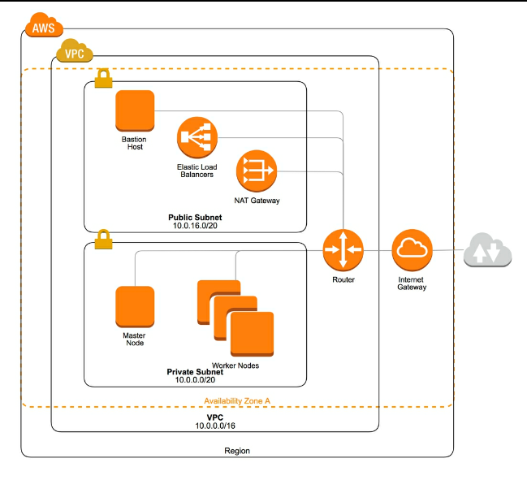
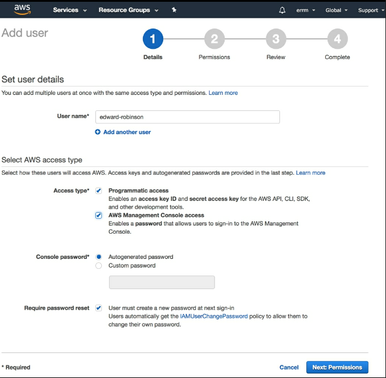
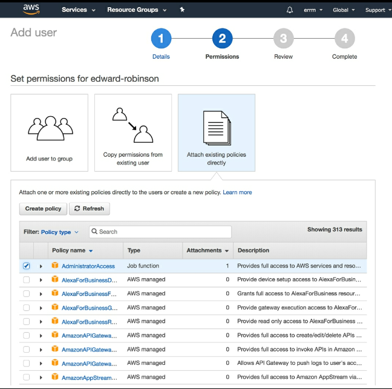
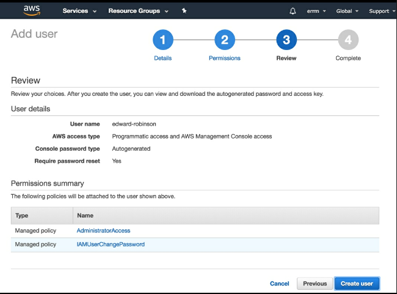
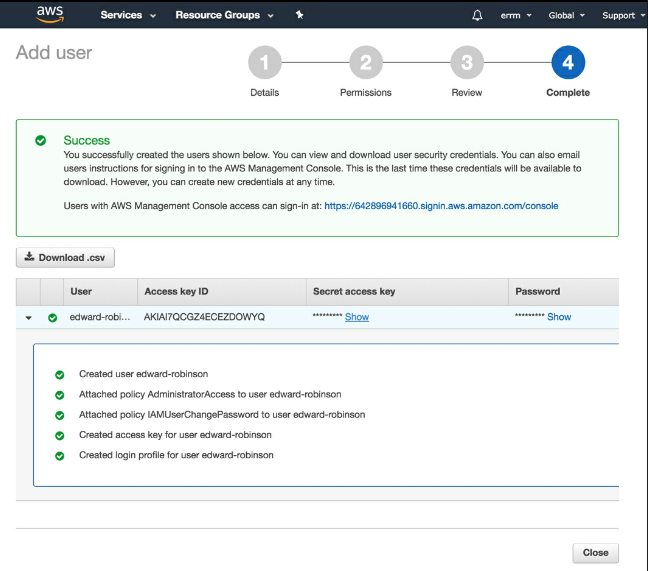
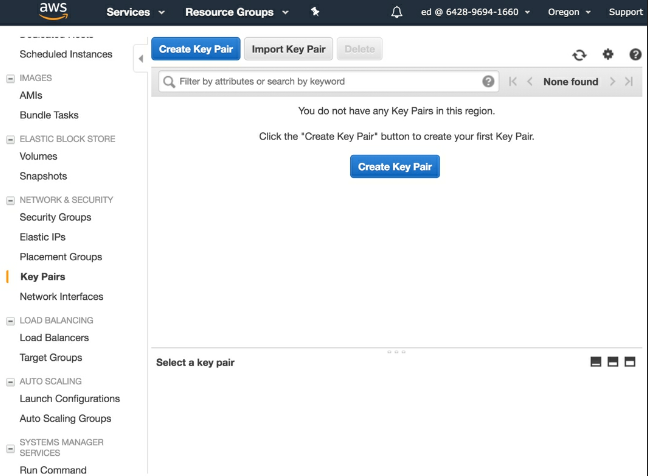
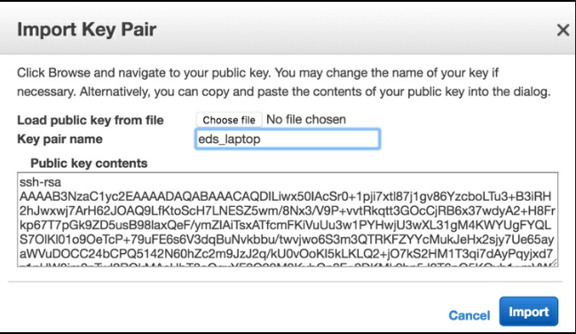

# 到达云端

在本章中，我们将学习如何构建在Amazon Web Services 上运行的 Kubernetes集群。 为了了解Kubernetes的工作原理，我们将手动启动将构成第一个集群的EC2实例，并手动安装和配置Kubernetes组件。

我们将构建一个合适你学习如何管理 Kubernetes 的集群化应用，并且帮助你开发一个简单的应用。我们的目标是构建可以部署到AWS的最简单的集群。 当然，这确实意味着你会在构建关键任务应用程序集群时要做一些不同的事情。 但不要担心 - 第3部分中有三章 - 准备生产，其中涵盖了您需要了解的所有内容，以便即使是最苛刻的应用程序也可以为集群做好准备。

Tip: 在 AWS 上运行 Kubernetes 集群需要花钱。 在撰写本文时，我们将在我们的说明中介绍的配置（具有一个主节点和一个工作节点的基本群集）将花费每月75美元左右。 因此，如果您只是使用群集进行实验和学习，请记住在当天结束时关闭实例。
  如果已完成群集，请终止实例并确保已删除EBS卷，因为即使已连接的实例已停止，您也将为这些存储卷付费。

本章旨在提供学习体验，因此请在阅读时仔细阅读并输入命令。 如果您有本书的电子书版本，那么就要抵制复制和粘贴的冲动，因为如果您输入命令并花些时间了解自己在做什么，您将学到更多。 有一些工具可以完成本章所涵盖的所有内容，更多只是通过运行一个命令，但希望逐步手动构建您的第一个集群，这将提高您的洞察力，让您了解制作Kubernetes集群所需的内容。

## 集群结构

我们将在本章中设置的集群将由两个EC2实例组成 - 一个将运行Kubernetes控制平面的所有组件，另一个可用于运行应用程序的工作节点。

因为我们从头开始，所以本章还将介绍一种在专用网络中隔离Kubernetes集群的方法，同时允许您从自己的工作站轻松访问这些机器。

我们将通过使用另一个实例作为堡垒主机来实现此目的，该主机将允许来自外部世界的传入SSH连接，如下图所示。 如果您的AWS账户已经有一些可以实现此目的的基础设施，那么可以跳过此部分：



## 创建一个AWS 账号

如果您还没有AWS账户，请访问 https://aws.amazon.com/ 并注册一个。 在您在帐户中创建资源之前，您需要在帐户中添加信用卡以支付任何费用。

首次注册AWS账户时，您将有资格获得前12个月某些服务的免费使用等级。 不幸的是，这个免费套餐没有提供足够的资源来运行 Kubernetes，但在本章中，我们已经优化了我们选择的实例，因为它们的成本很低，因此您应该能够在不花太多钱的情况下关注这些示例。

### 创建一个 IAM 的用户

注册AWS账户时，您选择的电子邮件地址和密码将用于登录root账户。 在开始与AWS交互之前，最好创建一个用于与AWS交互的IAM用户。 这样做的好处是，如果您愿意，您可以为每个 IAM 用户提供 AWS 服务所需的访问权限。 如果您使用root帐户，则您将自动拥有完全访问权限，无法管理或撤消权限。 完成以下步骤以设置帐户：

- 登录AWS控制台后，通过单击“服务”并在搜索框中键入IAM，转到“身份和访问管理”仪表板。

- 在侧边栏中，选择“用户”以查看您的 AWS 账户中的IAM用户。 如果您刚刚设置了一个新帐户，那么此处将不会有任何用户 root帐户不会被视为用户。

- 单击屏幕顶部的“添加用户”按钮，开始设置新用户帐户的过程。

- 首先为您的用户选择用户名。 选中这两个框以启用Programmatic访问（以便您可以使用命令行客户端）和AWS管理控制台访问权限，以便您可以登录Web控制台，如上面的屏幕截图所示：


- 在下一个屏幕上，您可以配置用户的权限。 选择直接附加现有策略，然后选择AdministratorAccess策略，如以下屏幕截图所示：


- 当你创建用户的时候，检查你的设置


- 创建用户后，请记下凭据。 您将很快需要 Access Key ID 和 Secret access key 来配置AWS命令行客户端。 另请注意控制台登录链接，因为这是您的 AWS 账户所独有的，如下所示：


- 为自己设置IAM用户后，请在浏览器中注销root帐户，并检查是否可以使用用户名和密码重新登录。

tip: 您可能希望为AWS账户设置二次身份验证，以提高安全性。 请记住，拥有该帐户管理员访问权限的任何人都可以访问或删除您帐户中的任何资源。

### 获取CLI

您可以使用Web控制台控制AWS，但如果您使用AWS命令行客户端从命令行执行所有操作，则您对AWS的控制将更加精确。

您应该按照AWS提供的说明，使用 https://docs.aws.amazon.com/cli/latest/userguide/installing.html 上的说明在您的系统上（或使用您的系统软件包管理器）安装命令行客户端。

安装命令行客户端后，运行 _aws configure_ 命令以使用凭据配置CLI。此命令将更新主目录中的 _aws config_ 文件。

在此阶段，您应该为群集选择AWS区域。对于测试和实验，您可以选择位置相对靠近您的位置。当您使用 ssh 或者 connect 访问你的实例的 ubernetes API时，这样做可以改善延迟。

### 设置密钥对

当我们启动EC2实例时，我们希望能够通过SSH访问它。 我们可以在EC2控制台中注册密钥对，以便我们在启动实例后登录。

我们可以指示AWS为您生成密钥对（然后您可以下载）。 但最佳做法是在工作站上生成密钥对并将公共部件上载到AWS。 这可以确保您（并且只有您）可以控制您的实例，因为您的密钥的私有部分永远不会离开您自己的计算机。 要设置密钥对，请执行以下步骤：

* 1. 您的计算机上可能已经有一个要使用的密钥对。 您可以通过查看 _.ssh_ 目录来检查现有密钥，如下所示：

``` sh
$ ls -la ~/.ssh
total 128
drwx------    6 edwardrobinson  staff    192 25 Feb 15:49 .
drwxr-xr-x+ 102 edwardrobinson  staff   3264 25 Feb 15:49 ..
-rw-r--r--    1 edwardrobinson  staff   1759 25 Feb 15:48 config
-rw-------    1 edwardrobinson  staff   3326 25 Feb 15:48 id_rsa
-rw-r--r--    1 edwardrobinson  staff    753 25 Feb 15:48 
id_rsa.pub
-rw-r--r--    1 edwardrobinson  staff  53042 25 Feb 15:48 
known_hosts
```

* 2. 在此示例中，您可以看到我的.ssh目录中有一个密钥对 - 私钥的默认名称为id_rsa，公钥名为id_rsa.pub。

* 3. 如果您尚未设置密钥对，或者如果要创建新密钥对，则可以使用ssh-keygen命令创建新密钥对，如下所示：

``` sh
$ ssh-keygen -t rsa -b 4096 -C "email@example.com"
Generating public/private rsa key pair.
```

- 4. 此命令使用您的电子邮件地址作为标签创建新密钥对。

- 5. 接下来，选择保存新密钥对的位置。 如果您还没有密钥对，只需按Enter键将其写入默认位置，如下所示：
```
Enter file in which to save the key (/home/edwardrobinson/.ssh/id_rsa):
```

- 6 接下来，将要求您输入密码（密码）。 如果只按Enter键，则将创建密钥而不进行任何密码保护，如以下命令所示。 如果您选择密码，请确保记住密码或将其安全存储，因为如果没有密码，您将无法使用SSH密钥（或访问您的实例）。

```
Enter passphrase (empty for no passphrase):
Enter same passphrase again:
Your identification has been saved in /home/edwardrobinson/.ssh/id_rsa.
Your public key has been saved in /home/edwardrobinson/.ssh/id_rsa.
The key fingerprint is:
SHA256:noWDFhnDxcvFl7DGi6EnF9EM5yeRMfGX1wt85wnbxxQ email@example.com

```

- 7 在计算机上拥有SSH密钥对后，您可以将其导入您的AWS账户。 请记住，您只需要导入密钥对的公共部分。 这将在一个以.pub扩展名结尾的文件中。

- 8 从AWS EC2控制台（单击“服务”然后搜索EC2），从屏幕左侧的菜单中选择“密钥对”，如以下屏幕截图所示：

- 9 在此屏幕中，选择导入密钥对以显示一个对话框，您可以在其中上传密钥对，如以下屏幕截图所示：


- 10 选择一个名称以识别AWS中的密钥对（我选择了eds_laptop）。 然后，导航到您的密钥位置或将其文本粘贴到大文本框中，然后单击“导入”。 导入密钥后，您应该会在密钥对页面上看到它。


如果您在多个区域中使用AWS，则需要在要在其中启动实例的每个区域中导入密钥对。
### 准备网络


我们将在您的AWS账户中设置一个新的VPC。 VPC或虚拟私有云允许我们拥有一个与EC2的所有其他用户以及我们可以启动实例的互联网隔离的专用网络。

它提供了一个安全的基础，我们可以使用它为我们的集群构建一个安全的网络，如以下命令所示：
``` sh
$ VPC_ID=$(aws ec2 create-vpc --cidr-block 10.0.0.0/16 --query "Vpc.VpcId" --output text)
```

VpcId对您的帐户来说是唯一的，因此我将设置一个shell变量，我可以在需要时使用它来引用它。 您可以使用自己帐户中的VpcId执行相同的操作，或者您可能希望每次需要时都输入它。

本章的其余步骤遵循此模式，但如果您不了解发生的情况，请不要害怕查看shell变量并将ID与AWS控制台中的资源相关联，如下所示：
``` sh 
$echo $VPC_ID
```
Kubernetes根据AWS分配给他们的内部DNS主机名命名您的实例。 如果我们在VPC中启用DNS支持，那么我们将能够在使用VPC内提供的DNS服务器时解析这些主机名，如下所示：

``` sh

$ aws ec2 modify-vpc-attribute \
    --enable-dns-support \
    --vpc-id $VPC_ID
$ aws ec2 modify-vpc-attribute \
    --enable-dns-hostnames \
    --vpc-id $VPC_ID

```

Kubernetes 广泛使用 AWS资源标记，因此它知道它可以使用哪些资源以及哪些资源由Kubernetes管理。 这些标签的关键是 kubernetes.io/cluster/ [cluster_name]。 对于可能在多个不同群集之间共享的资源，我们使用共享值。 这意味着 Kubernetes 可以使用它们，但不会从您的帐户中删除它们。

我们会将此用于VPC等资源。 生命周期由Kubernetes完全管理的资源具有标记值，如果不再需要，可以由Kubernetes删除。 Kubernetes通常在创建资源（例如自动扩展组，EBS卷或负载平衡器中的实例）时自动创建这些标记。

tip: 我喜欢用计算机科学史上的知名人士命名我创建的集群。 我为本章创建的集群以设计COBOL编程语言的Grace Hopper命名。


让我们为新的VPC添加一个标签，以便Kubernetes能够使用它，如以下命令所示：

```
aws ec2 create-tags \
--resources $VPC_ID \
--tags Key=Name,Value=hopper \
  Key=kubernetes.io/cluster/hopper,Value=shared

```

当我们创建VPC时，会自动创建一个主路由表。 我们将使用它在我们的私有子网中进行路由。 让我们获取稍后使用的ID，如以下命令所示：

```
$ PRIVATE_ROUTE_TABLE_ID=$(aws ec2 describe-route-tables \
    --filters Name=vpc-id,Values=$VPC_ID \
    --query "RouteTables[0].RouteTableId" \
    --output=text)

```

现在我们将添加第二个路由表来管理VPC中公共子网的路由，如下所示：

``` sh
$ PUBLIC_ROUTE_TABLE_ID=$(aws ec2 create-route-table \
  --vpc-id $VPC_ID \
  --query "RouteTable.RouteTableId" --output text)

```
现在我们将给出路由表名称，以便我们以后跟踪它们：
```
$ PUBLIC_ROUTE_TABLE_ID=$(aws ec2 create-route-table \
  --vpc-id $VPC_ID \
  --query "RouteTable.RouteTableId" --output text)

```
现在我们将给出路由表名称，以便我们以后跟踪它们：

``` sh

$ aws ec2 create-tags \
  --resources $PUBLIC_ROUTE_TABLE_ID \
  --tags Key=Name,Value=hopper-public
$ aws ec2 create-tags \
  --resources $PRIVATE_ROUTE_TABLE_ID \
  --tags Key=Name,Value=hopper-private

```

接下来，我们将为集群创建两个子网以供使用。 因为我正在eu-west-1地区（爱尔兰）创建我的集群，所以我将在eu-west-1a子网中创建这些子网。 您应该通过运行 _aws ec2 describe-availability-zones_ 从您正在使用的区域中为您的群集选择可用区域。 在部分 3，我们将学习如何创建跨多个可用区域的高可用性集群。

让我们首先为专用网络中访问的实例创建一个子网。 我们将在 CIDR 块上使用 /20 网络掩码，如以下命令所示; 有了这个，AWS 将为我们提供 4089 个 IP 地址，这些 IP 地址可以分配给我们的 EC2 实例和 Kubernetes 发布的 pod：

```
$ PRIVATE_SUBNET_ID=$(aws ec2 create-subnet \
  --vpc-id $VPC_ID \
  --availability-zone eu-west-1a \
  --cidr-block 10.0.0.0/20 --query "Subnet.SubnetId" \
  --output text)
    
$ aws ec2 create-tags \
  --resources $PRIVATE_SUBNET_ID \
  --tags Key=Name,Value=hopper-private-1a \
    Key=kubernetes.io/cluster/hopper,Value=owned \
    Key=kubernetes.io/role/internal-elb,Value=1

```

接下来，让我们将另一个子网添加到同一可用区，如以下命令所示。 我们将此子网用于需要从Internet访问的实例，例如公共负载平衡器和堡垒主机：

```
$ PUBLIC_SUBNET_ID=$(aws ec2 create-subnet \
  --vpc-id $VPC_ID \
  --availability-zone eu-west-1a \
  --cidr-block 10.0.16.0/20 --query "Subnet.SubnetId" \
  --output text)
    
$ aws ec2 create-tags \
  --resources $PUBLIC_SUBNET_ID \
  --tags Key=Name,Value=hopper-public-1a \
    Key=kubernetes.io/cluster/hopper,Value=owned \
    Key=kubernetes.io/role/elb,Value=1
```
接下来，我们应该将此子网与公共路由表关联，如下所示：

```
$ aws ec2 associate-route-table \
  --subnet-id $PUBLIC_SUBNET_ID \
  --route-table-id $PUBLIC_ROUTE_TABLE_ID
```
为了让我们的公共子网中的实例与互联网通信，我们将创建一个互联网网关，将其连接到我们的VPC，然后添加到路由表的路由，将绑定到互联网的流量路由到网关，如图所示 在以下命令中：

``` sh

$ INTERNET_GATEWAY_ID=$(aws ec2 create-internet-gateway \
    --query "InternetGateway.InternetGatewayId" 
    --output text)
    
$ aws ec2 attach-internet-gateway \
    --internet-gateway-id $INTERNET_GATEWAY_ID \
    --vpc-id $VPC_ID
    
$ aws ec2 create-route \
    --route-table-id $PUBLIC_ROUTE_TABLE_ID \
    --destination-cidr-block 0.0.0.0/0 \
    --gateway-id $INTERNET_GATEWAY_ID

```
为了配置私有子网中的实例，我们需要它们能够建立到Internet的出站连接以便安装软件包等。 为了实现这一点，我们将向公共子网添加NAT网关，然后将路由添加到私有路由表以获取Internet绑定流量，如下所示：

``` sh

$ NAT_GATEWAY_ALLOCATION_ID=$(aws ec2 allocate-address \
  --domain vpc --query AllocationId --output text)
    
$ NAT_GATEWAY_ID=$(aws ec2 create-nat-gateway \
  --subnet-id $PUBLIC_SUBNET_ID \
  --allocation-id $NAT_GATEWAY_ALLOCATION_ID \
  --query NatGateway.NatGatewayId --output text)

```
在此阶段，您可能需要等待片刻才能在创建路由之前创建NAT网关，如以下命令所示：

```
$ aws ec2 create-route \
    --route-table-id $PRIVATE_ROUTE_TABLE_ID \
    --destination-cidr-block 0.0.0.0/0 \
    --nat-gateway-id $NAT_GATEWAY_ID
```

## 设置堡垒

我们将使用我们将要启动的第一台主机作为堡垒主机，这将允许我们连接到只能从我们的VPC网络的私有端访问的其他服务器。 我们将创建一个安全组以允许SSH流量到此实例。 
我们将使用 _aws ec2 create-security-group_ 命令为我们的堡垒主机创建一个安全组，如以下命令所示。 安全组是AWS提供的抽象，用于将相关的防火墙规则组合在一起并将其应用于主机组：

```
$ BASTION_SG_ID=$(aws ec2 create-security-group \
    --group-name ssh-bastion \
    --description "SSH Bastion Hosts" \
    --vpc-id $VPC_ID \
    --query GroupId --output text)

```

创建安全组后，我们可以为其附加规则以允许端口22上的SSH入口，如以下命令所示。 这将允许您使用SSH客户端访问主机。 在这里，我允许从 CIDR 范围 0.0.0.0/0 进入，但如果您的 Internet 连接具有稳定的IP地址，您可能希望限制对您自己的IP的访问：

```
$ aws ec2 authorize-security-group-ingress \
  --group-id $BASTION_SG_ID \
  --protocol tcp \
  --port 22 \
  --cidr 0.0.0.0/0
```
现在我们已经为堡垒主机设置了安全组，我们可以启动我们的第一个EC2实例。 在本章中，我将使用Ubuntu Linux（一种流行的Linux发行版）。 在我们启动实例之前，我们需要发现我们想要使用的操作系统的AMI（亚马逊机器映像）的ID。 

Ubuntu项目定期向其 AWS 账户发布更新的图像，可用于启动EC2实例。 我们可以运行以下命令来发现我们需要的图像的ID：

``` sh
$ UBUNTU_AMI_ID=$(aws ec2 describe-images --owners 099720109477 \
  --filters Name=root-device-type,Values=ebs \
            Name=architecture,Values=x86_64 \
            Name=name,Values='*hvm-ssd/ubuntu-xenial-16.04*' \
  --query "sort_by(Images, &Name)[-1].ImageId" --output text)

```
我们将使用t2.micro实例作为堡垒主机（如以下命令所示），因为此实例类型的用法包含在AWS免费套餐中，因此您无需为此付费。 设置AWS账户后的前12个月：

```sh
$ BASTION_ID=$(aws ec2 run-instances \
  --image-id $UBUNTU_AMI_ID \
  --instance-type t2.micro \
  --key-name eds_laptop \
  --security-group-ids $BASTION_SG_ID \
  --subnet-id $PUBLIC_SUBNET_ID \
  --associate-public-ip-address \
  --query "Instances[0].InstanceId" \
  --output text)
```

请注意，我们正在传递我们选择使用的子网的ID，我们刚刚创建的安全组的ID以及我们上传的密钥对的名称。

接下来，让我们使用Name标签更新实例，以便在查看EC2控制台时识别它，如以下命令所示：

``` sh
$ aws ec2 create-tags \
  --resources $BASTION_ID \
  --tags Key=Name,Value=ssh-bastion
```
实例启动后，您应该能够运行 _aws ec2 describe-instances_ 命令来发现新实例的公共IP地址，如下所示：

``` sh
$ BASTION_IP=$(aws ec2 describe-instances \
  --instance-ids $BASTION_ID \
  --query "Reservations[0].Instances[0].PublicIpAddress" \
  --output text)
```
您现在应该能够使用SSH访问实例，如下所示：

``` sh
$ ssh ubuntu@$BASTION_IP
```
登录时，您应该看到如下消息：

```
Welcome to Ubuntu 16.04.3 LTS (GNU/Linux 4.4.0-1052-aws x86_64)
* Documentation:  https://help.ubuntu.com
 * Management:     https://landscape.canonical.com
 * Support:        https://ubuntu.com/advantage
    
  Get cloud support with Ubuntu Advantage Cloud Guest:
        http://www.ubuntu.com/business/services/cloud
    
 0 packages can be updated.
 0 updates are security updates.
    
 
 To run a command as administrator (user "root"), use "sudo <command>".
 See "man sudo_root" for details.
    
 ubuntu@ip-10-0-26-86:~$

```

Tip: 如果您将密钥对保存为默认值~/.ssh/id_rsa以外的其他密钥对，则可以使用-i标志将路径传递给密钥，如下所示：
 ssh -i ~/.ssh/id_aws_rsa ubuntu@$BASTION_IP
 作为替代方法，您可以通过运行以下命令首先将密钥添加到SSH代理：
 ssh -add ~/.ssh/id_aws_rsa

### sshuttle

只需使用SSH，就可以将流量从工作站转发到专用网络。 但是，通过使用 sshuttle 工具，我们可以通过堡垒实例更方便地访问服务器。

在工作站上安装sshuttle很简单。

您可以使用 Homebrew 在 macOS 上安装它，如下所示：

``` sh
brew install sshuttle
```
您也可以在Linux上安装它（如果安装了Python），如下所示：
```
pip install sshuttle

```
要透明地将流量代理到专用网络内的实例，我们可以运行以下命令：
```
$ sshuttle -r ubuntu@$BASTION_IP 10.0.0.0/16 --dns
[local sudo] Password:
client: Connected.
```

首先，我们传递我们的 ubuntu@$BASTION_IP 堡垒实例的 SSH 登录详细信息，然后是我们的VPC的CIDR（这样只有发往专用网络的流量才能通过隧道）; 这可以通过运行 _aws ec2 describe-vpcs_ 找到。 最后，我们传递--dns标志，以便远程实例的 DNS 服务器解析工作站上的DNS查询。

使用sshuttle要求您输入本地sudo密码才能设置其代理服务器。

Tip: 您可能希望在单独的终端或后台运行sshuttle，以便您仍然可以访问我们一直使用的shell变量。

我们可以通过尝试通过其私有DNS名称登录我们的实例来验证此设置是否正常工作，如下所示：

``` sh
$ aws ec2 describe-instances \
  --instance-ids $BASTION_ID \
  --query "Reservations[0].Instances[0].PrivateDnsName"
    
"ip-10-0-21-138.eu-west-1.compute.internal"
    
$ ssh ubuntu@ip-10-0-21-138.eu-west-1.compute.internal

```

这将测试您是否可以将 AWS 提供的私有 DNS中的条目解析为 VPC 中运行的实例，以及该查询现在返回的私有IP地址是否可访问。 如果您遇到任何困难，请检查sshuttle是否存在任何连接错误，并确保您已记住在 VPC 中启用 DNS 支持。

## 实例简介
为了让 Kubernetes 利用其与 AWS 云 API 的集成，我们需要设置 IAM 实例配置文件。 实例配置文件是 Kubernetes 软件使用 AWS API进行身份验证的一种方式，也是我们为Kubernetes可以采取的操作分配细粒度权限的方法。 

学习Kubernetes正常运行所需的所有权限可能会令人困惑。 您可以设置允许完全访问AWS的实例配置文件，但这会牺牲安全性最佳实践。

每当我们分配安全权限时，我们的目标应该是为我们的软件提供足够的权限才能正常运行。 为此，我整理了一组最小的IAM策略，这些策略将允许我们的集群正常运行，而无需提供过多的权限。

您可以在 https://github.com/errm/k8s-iam-policies 上查看这些策略，其中我记录了每个策略，并简要说明了其用途。

存储库包含一个简单的shell脚本，我们可以使用它来为集群中的主节点和工作节点创建IAM实例配置文件，如下所示：
```
$ curl https://raw.githubusercontent.com/errm/k8s-iam-policies/master/setup.sh -o setup.sh
$ sh -e setup.sh
  {
      "InstanceProfile": {
          "Path": "/",
          "InstanceProfileName": "K8sMaster",
          "InstanceProfileId": "AIPAJ7YTS67QLILBZUQYE",
          "Arn": "arn:aws:iam::642896941660:instance-profile/K8sMaster",
          "CreateDate": "2018-02-26T19:06:19.831Z",
          "Roles": []
      }
  }
  {
      "InstanceProfile": {
          "Path": "/",
          "InstanceProfileName": "K8sNode",
          "InstanceProfileId": "AIPAJ27KNVOKTLZV7DDA4",
          "Arn": "arn:aws:iam::642896941660:instance-profile/K8sNode",
          "CreateDate": "2018-02-26T19:06:25.282Z",
          "Roles": []
      }
  }


## Kubernetes 软件

我们将启动一个实例，在该实例中，我们将安装构成我们的集群的不同节点所需的所有软件。 然后，我们将创建一个AMI或亚马逊机器映像，我们可以使用它来启动集群上的节点。

首先，我们为此实例创建一个安全组，如下所示：

```
$ K8S_AMI_SG_ID=$(aws ec2 create-security-group \
    --group-name k8s-ami \
    --description "Kubernetes AMI Instances" \
    --vpc-id $VPC_ID \
    --query GroupId \
    --output text)

```
我们需要能够从堡垒主机访问此实例才能登录并安装软件，所以让我们添加一条规则，允许端口22上的SSH流量来自ssh-bastion安全组中的实例，如下所示：
```
$ aws ec2 authorize-security-group-ingress \
    --group-id $K8S_AMI_SG_ID \
    --protocol tcp \
    --port 22 \
    --source-group $BASTION_SG_ID

```

我们只是在这里使用t2.mico实例，因为我们不需要一个非常强大的实例来安装包，如以下命令所示：

```
$ K8S_AMI_INSTANCE_ID=$(aws ec2 run-instances \
    --subnet-id $PRIVATE_SUBNET_ID \
    --image-id $UBUNTU_AMI_ID \
    --instance-type t2.micro \
    --key-name eds_laptop \
    --security-group-ids $K8S_AMI_SG_ID \
    --query "Instances[0].InstanceId" \
    --output text)

```

我们添加一个Name标签，以便我们可以在以后需要时识别该实例，如下所示：

```
$ aws ec2 create-tags \
    --resources $K8S_AMI_INSTANCE_ID \
    --tags Key=Name,Value=kubernetes-node-ami
```
获取实例的IP地址，如下所示：
```
$ K8S_AMI_IP=$(aws ec2 describe-instances \
    --instance-ids $K8S_AMI_INSTANCE_ID \
    --query "Reservations[0].Instances[0].PrivateIpAddress" \
    --output text)

```

然后使用ssh登录，如下所示：

```
$ ssh ubuntu@$K8S_AMI_IP

```

现在我们准备开始使用我们集群中所有节点都需要的软件和配置来配置实例。 首先同步apt存储库，如下所示：
``` sh
$ sudo apt-get update
```

### Docker

Kubernetes可以使用多个容器运行时，但Docker仍然是使用最广泛的。

在我们安装Docker之前，我们将向Docker服务添加systemd drop-in配置文件，如下所示：
```
/etc/systemd/system/docker.service.d/10-iptables.conf
[Service]
ExecStartPost=/sbin/iptables -P FORWARD ACCEPT

```
为了使我们的Kubernetes pod可以被集群中的其他实例访问，我们需要为 _iptables FORWARD_ 链设置默认策略，如以下命令所示; 否则，Docker 会将此设置为 DROP，并且将删除Kubernetes服务的流量：

```
$ sudo mkdir -p /etc/systemd/system/docker.service.d/
$ printf "[Service]\nExecStartPost=/sbin/iptables -P FORWARD ACCEPT" |   sudo tee /etc/systemd/system/docker.service.d/10-iptables.conf
```

Kubernetes可以很好地使用Ubuntu存储库中包含的Docker版本，因此我们可以通过安装docker.io包安装它，如下所示：
```
$ sudo apt-get install -y docker.io
```
确认 Docker 是否安装成功
```
$ sudo docker version

```

## 安装Kubeadm
接下来，我们将安装在此主机上设置Kubernetes控制平面所需的软件包。 以下列表中描述了这些包：

- kubelet：Kubernetes 用于控制容器运行时的节点代理程序。 这用于在Docker容器中运行控制平面的所有其他组件。 

- kubeadm：该实用程序负责引导Kubernetes集群。

- kubectl：Kubernetes命令行客户端，它允许我们与Kubernetes API服务器进行交互。

首先，为托管Kubernetes包的apt存储库添加签名密钥，如下所示：

``` sh
$ curl -s https://packages.cloud.google.com/apt/doc/apt-key.gpg | sudo apt-key add -
OK
```

接下来添加Kubernetes apt存储库，如下所示：

```
$ sudo apt-add-repository 'deb http://apt.kubernetes.io/ kubernetes-xenial main'
```

然后，重新同步包索引，如下所示：

```
$ sudo apt-get update

```
然后，安装所需的包，如下所示：
```
$ sudo apt-get install -y kubelet kubeadm kubectl

```

Tips: 这将安装最新版本的软件包。 如果您想要固定特定版本的Kubernetes，请尝试运行 _apt-cache madison kubeadm_ 以查看可用的不同版本。
  我已经使用Kubernetes 1.10编写了本章。 如果您想安装最新版本的Kubernetes 1.10，则可以运行以下命令：
_sudo apt-get install kubeadm=1.10.* kubectl=1.10.* kubelet=1.10.*_
### 构建 AMI

现在我们已完成在此实例上安装软件包，我们可以将其关闭，如下所示：

```
$ sudo shutdown -h now
Connection to 10.0.13.93 closed by remote host.
Connection to 10.0.13.93 closed.

```
我们可以使用 _create-image_ 命令指示 AWS 对我们实例的根卷进行快照并使用它来生成 AMI，如以下命令所示（您可能需要等待片刻才能使实例在运行之前完全停止 命令）：

```
$ K8S_AMI_ID=$(aws ec2 create-image \
        --name k8s-1.10.3-001 \
        --instance-id $K8S_AMI_INSTANCE_ID \
        --description "Kubernetes v1.10.3" \
        --query ImageId \ 
       --output text)
```
图像可能需要几分钟才能供您使用，但您可以使用describe-images命令检查其状态，如下所示：
```
aws ec2 describe-images \
     --image-ids $K8S_AMI_ID \
     --query "Images[0].State"

```
在构建映像时，您将看到挂起，但一旦准备好使用，状态将变为可用。

## 引导集群

现在我们可以为Kubernetes控制平面组件启动一个实例。 首先，我们将为这个新实例创建一个安全组，如下所示：
```
$ K8S_MASTER_SG_ID=$(aws ec2 create-security-group \
    --group-name k8s-master \
    --description "Kubernetes Master Hosts" \
    --vpc-id $VPC_ID \
    --query GroupId \
    --output text)

```
我们需要能够从堡垒主机访问此实例才能登录并配置群集。 我们将添加一条规则，允许22端口上的 SSH 流量来自 _ssh-bastion_ 全组中的实例，如下所示：
```
$ aws ec2 authorize-security-group-ingress \
    --group-id $K8S_MASTER_SG_ID \
    --protocol tcp \
    --port 22 \
    --source-group $BASTION_SG_ID

```

现在我们可以启动实例，如下所示：

```
$ K8S_MASTER_INSTANCE_ID=$(aws ec2 run-instances \
    --private-ip-address 10.0.0.10 \
    --subnet-id $PRIVATE_SUBNET_ID \
    --image-id $K8S_AMI_ID \
    --instance-type t2.medium \
    --key-name eds_laptop \
    --security-group-ids $K8S_MASTER_SG_ID \
    --credit-specification CpuCredits=unlimited \
    --iam-instance-profile Name=K8sMaster \
    --query "Instances[0].InstanceId" \
    --output text)

```
我们应该为实例指定一个名称，并确保Kubernetes可以将所有资源与我们的集群相关联，我们还将添加带有此集群名称的 KubernetesCluster 标记，如下所示：
```
$ aws ec2 create-tags \
  --resources $K8S_MASTER_INSTANCE_ID \
  --tags Key=Name,Value=hopper-k8s-master \
    Key=kubernetes.io/cluster/hopper,Value=owned
$ ssh ubuntu@10.0.0.10

```
要确保所有Kubernetes组件使用相同的名称，我们应将主机名设置为与AWS元数据服务提供的名称相匹配，如以下命令所示。 这是因为元数据服务中的名称由启用了AWS云提供程序的组件使用：
```
$ sudo hostnamectl set-hostname $(curl http://169.254.169.254/latest/meta-data/hostname)
$ hostnamectl status
   Static hostname: ip-10-0-0-10.eu-west-1.compute.internal

```
要正确配置 kubelet 以使用AWS云提供程序，我们创建一个 _systemd_ 插件文件以将一些额外的参数传递给kubelet，如下所示：

```
/etc/systemd/system/kubelet.service.d/20-aws.conf
[Service]
Environment="KUBELET_EXTRA_ARGS=--cloud-provider=aws --node ip=10.0.0.10"
$ printf '[Service]\nEnvironment="KUBELET_EXTRA_ARGS=--cloud-provider=aws --node-ip=10.0.0.10"' | sudo tee /etc/systemd/system/kubelet.service.d/20-aws.conf

```
添加此文件后，重新加载systemd配置，如下所示：
```
$ sudo systemctl daemon-reload
$ sudo systemctl restart kubelet

```
我们需要为 _kubeadm_ 提供配置文件，以便在将要启动的每个组件上启用AWS云提供程序。 在这里，我们还将tokenTTL设置为0，如以下命令所示; 这意味着为允许工作节点加入群集而发出的令牌不会过期。 这很重要，因为我们计划使用自动缩放组管理我们的工作人员，并且新节点可以在一段时间后加入该组：
```
kubeadm.config
apiVersion: kubeadm.k8s.io/v1alpha1
kind: MasterConfiguration
cloudProvider: aws
tokenTTL: "0"

```
现在我们只需运行以下命令来引导主服务器：
``` sh
$ sudo kubeadm init --config=kubeadm.config 
[init] Using Kubernetes version: v1.10.3 .. .
. . .
. . . 
Your Kubernetes master has initialized successfully!
. . .
```

您应该看到前面的消息，然后是一些说明来设置群集的其余部分。 记下 _kubeadm join_ 命令，因为我们需要它来设置 worker node(s)。

我们可以按照 _kubeadm_ 提供的指令在主机上设置 _kubectl_ 来检查API服务器是否正常运行，如以下命令所示：
```
$ mkdir -p $HOME/.kube
$ sudo cp -i /etc/kubernetes/admin.conf $HOME/.kube/config
$ sudo chown $(id -u):$(id -g) $HOME/.kube/config

```

尝试运行kubectl版本。 如果kubectl可以正确连接到主机，那么您应该能够看到客户端（kubectl）和服务器上的Kubernetes软件的版本，如以下命令所示：
```
$ kubectl version
Client Version: version.Info{Major:"1", Minor:"9", GitVersion:"v1.9.3", GitCommit:"d2835416544f298c919e2ead3be3d0864b52323b", GitTreeState:"clean", BuildDate:"2018-02-07T12:22:21Z", GoVersion:"go1.9.2", Compiler:"gc", Platform:"linux/amd64"}
Server Version: version.Info{Major:"1", Minor:"9", GitVersion:"v1.9.3", GitCommit:"d2835416544f298c919e2ead3be3d0864b52323b", GitTreeState:"clean", BuildDate:"2018-02-07T11:55:20Z", GoVersion:"go1.9.2", Compiler:"gc", Platform:"linux/amd64"}

```
这很容易吧？ 我们通过运行一个命令启动并运行 Kubernetes 控制平面。

kubeadm命令是一个很棒的工具，因为正确配置Kubernetes 的情况下，可能还有些过程还不是很理解。因此，让我们暂时停止设置我们的集群，并深入挖掘一下，以发现实际发生的事情。

看看kubeadm命令的输出应该给我们一些线索。
## 刚才发生了什么？

这很容易吗？我们通过运行一个命令启动并运行Kubernetes控制平台。

kubeadm命令是一个很棒的工具，因为正确配置Kubernetes需要大量的猜测。但是，让我们暂时停止设置我们的集群，并深入挖掘一下，以发现实际发生的事情。

看看kubeadm命令的输出应该给我们一些线索。

kubeadm做的第一件事就是建立一个私钥基础设施。如果你看一下/etc/kubernetes/pki目录，您可以看到许多ssl证书和私钥，以及用于签署每个密钥对的证书颁发机构。现在，当我们将工作节点添加到集群时，他们将能够在 kubelet 和 apiserver 之间建立安全通信。
 
接下来，kubedam 将静态 pod 清单写入/etc/kubernetes/manifests/ 目录，这些清单就像您要提交给Kubernetes API服务器以运行您自己的应用程序的pod定义，但由于API服务器尚未启动，因此kubelet会直接从磁盘读取定义。

kubeadm做的第一件事就是在 _etc/systemd/system/kubelet.service.d/10-kubeadm.conf_ 中建立一个私钥基础设施。 您可以在其他配置中看到以下标志
```
--pod-manifest-path=/etc/kubernetes/manifests
```
如果查看/etc/kubernetes/manifests/，您将看到构成控制平面的每个组件的Kubernetes pod规范，如下表所述：

- tcd.yaml: The key value store that stores the state of the API server 
- kube-apiserver.yaml: The API server
- kube-controller-manager.yaml: The controller manager
- kube-scheduler.yaml: The scheduler

最后，一旦API服务器启动，kubeadm 就会向 API提交两个加载项，如下面的清单所述
- kube-proxy: 这是在每个节点上配置iptables以使服务IP路由正确的过程。 它使用DaemonSet在每个节点上运行。 您可以通过运行 _kubectl -n kube-system describe ds kube-proxy_ 来查看此配置。
- kube-dns: 此过程提供DNS服务器，可由群集上运行的应用程序使用以进行服务发现。 请注意，在为群集配置Pod网络之前，它将无法正常运行。 您可以通过运行 _kubectl -n kube-system describe deployment kube-dns_ 来查看kube-dns的配置.

tip: 您可以尝试使用kubectl来探索构成Kubernetes控制平面的不同组件。尝试运行以下命令
``` sh
$ kubectl -n kube-system get pods
$ kubectl -n kube-system describe pods
$ kubectl -n kube-system get daemonsets
$ kubectl -n kube-system get deployments 
Before you continue with the next section, log out of the master instance, as follows: 
$ exit logout 
Connection to 10.0.0.10 closed
```
## 从工作站访问API

通过工作站上的 kubectl 访问Kubernetes API服务器很方便。 这意味着您可以向AWS上运行的集群提交您可能正在开发的任何清单。

我们需要允许来自堡垒服务器的流量访问API服务器。 让我们为K8S-MASTER安全组添加规则以允许此流量，如下所示：
```
$ aws ec2 authorize-security-group-ingress \   
    --group-id $K8S_MASTER_SG_ID \   
    --protocol tcp \   
    --port 6443 \   
    --source-group $BASTION_SG_ID
```
如果您尚未在工作站上安装kubectl，请返回第2章，启动引擎，了解具体方法。
现在我们可以从主实例复制kubeconfig文件
如果您还没有在本地 ~/.kube/config 文件中配置任何群集，则可以从主服务器复制该文件，如下所示

```
$ scp ubuntu@10.0.0.10:~/.kube/config ~/.kube/config
```

Tips: 提示：如果您已经配置了群集（例如，minikube），那么您可能希望合并新群集的配置，或使用其他文件并使用 _--kubeconfig_ 标志将其位置传递给kubectl，或者在 KUBECONFIG  环境变量中
检查您是否可以使用本地kubectl连接到API服务器，如下所示
```
$ kubectl get nodes
NAME               STATUS     AGE       VERSION
ip-10-0-9-172...   NotReady   5m        v1.9.3
```
如果您在连接时遇到任何问题，请检查sshuttle是否仍在运行，以及您是否正确允许从堡垒主机访问k8s-master安全组
## 设置 pod 网络连接

您可能已经注意到，在运行kubectl get节点时，NodeStatus是NotReady。 这是因为我们已经引导的集群缺少一个基本组件网络基础设施，它将允许我们集群上运行的pod相互通信。

Kubernetes 集群的网络模型与标准 Docker安装的网络模型略有不同。 网络基础设施的许多实现可以为Kubernetes提供集群网络，但它们都有一些共同的关键属性，如下面的列表所示

- 每个窗格都分配有自己的IP地址
- 每个窗格可以与群集中的任何其他窗格进行通信，而无需NAT（不能承受其他安全策略）。
- 容器中运行的软件所看到的内部网络与其他窗格中看到的窗格网络相同。 在这个集群中，它看到IP地址是相同的，并且没有发生端口映射

这种网络安排比Docker将容器中的内部端口映射到主机上的其他端口的标准网络方案简单得多（对于群集用户而言）

但是，它需要在网络基础设施和Kubernetes之间进行一些集成。 Kubernetes通过称为容器网络接口（CNI）的接口来管理此集成。 使用Kubernetes DaemonSet将CNI插件部署到集群的每个节点很简单

如果您想了解有关Kubernetes集群网络的更多信息，我建议您阅读基础概念的综合文档，网址为https://kubernetes.io/docs/concepts/cluster-administration/networking/

我们将部署名为amazon-vpc-cni-k8s的CNI插件，该插件将Kubernetes与AWS VPC网络的本机网络功能集成在一起。 此插件的工作原理是将辅助私有IP地址附加到构成我们集群节点的EC2实例的弹性网络接口，然后将它们分配给由Kubernetes调度进入每个节点的容器。 然后，AWS VPC网络结构将流量直接路由到正确的节点

部署此插件与使用kubectl向Kubernetes API提交任何其他清单的过程类似，如以下命令所示

``` sh

$ kubectl apply -f https://raw.githubusercontent.com/aws/amazon-vpc-cni-k8s/master/config/v1.3/aws-k8s-cni.yaml daemonset aws-node created
```
您可以通过运行以下命令来监视正在安装和启动的网络插件
```
$ kubectl -n kube-system describe pods aws-node
```
我们可以通过再次查看节点状态来检查网络是否已正确设置，如下所示

```
$ kubectl get nodes 
NAME STATUS ROLES AGE VERSION 
ip-172-31-29-230 Ready master 10m v1.9.3
```

## 运行工作节点
我们接下来会为工作节点创建一个安全组，如下所示： 

``` sh
$ K8S_NODES_SG_ID=$(aws ec2 create-security-group \ 
    --group-name k8s-nodes \ 
    --description Kubernetes Nodes \ 
    --vpc-id $VPC_ID \
    --query GroupId \
    --output text)`
```
我们将允许通过堡垒主机访问工作节点，以便我们登录以进行调试，如下所示

``` sh
$ aws ec2 authorize-security-group-ingress \ 
    --group-id $K8S_NODES_SG_ID \ 
    --protocol tcp \ 
    --port 22 \ 
    --source-group $BASTION_SG_ID
```
我们希望允许在工作节点上运行的kubelet和其他进程能够连接到主节点上的API服务器。 我们使用以下命令执行此操作：
```
$ aws ec2 authorize-security-group-ingress \ 
    --group-id $K8S_MASTER_SG_ID \ 
    --protocol tcp \ 
    --port 6443 \ 
    --source-group $K8S_NODES_SG_ID
```
由于kube-dns附加组件可以在主节点上运行，让我们允许来自节点安全组的此流量，如下所示:

``` sh
$ aws ec2 authorize-security-group-ingress \ 
    --group-id $K8S_MASTER_SG_ID \ 
    --protocol all \ 
    --port 53 \ 
    --source-group $K8S_NODES_SG_ID
```
我们还需要主节点能够连接到kubelet公开的API，以便传输日志和其他指标。 我们通过输入以下命令来启用它
``` sh
$ aws ec2 authorize-security-group-ingress \ 
    --group-id $K8S_NODES_SG_ID \ 
    --protocol tcp \ --port 10250 \ 
    --source-group $K8S_NODES_SG_ID

$ aws ec2 authorize-security-group-ingress \ 
    --group-id $K8S_NODES_SG_ID \ 
    --protocol tcp \ 
    --port 10255 \ 
    --source-group $K8S_NODES_SG_ID
```
最后，我们需要允许任何节点上的任何pod连接到任何其他pod。我们使用以下命令执行此操作

``` sh
$ aws ec2 authorize-security-group-ingress \ 
    --group-id $K8S_NODES_SG_ID \ 
    --protocol all \ 
    --port -1 \ 
    --source-group $K8S_NODES_SG_ID
```

为了让工作节点在启动时向主节点注册，我们将创建一个用户数据脚本

此脚本在第一次启动节点时运行。 它进行一些配置更改，然后运行 _kubeadm join_ ，如以下命令所示。 在初始化master时，您应该记下 _kubeadm join_ 命令

``` vi
user-data.sh
#!/bin/bash

set-exuo pipefail
hostnamectl set-hostname $(curl http://169.254.169.254/latest/meta-data/host-name)

cat << EOF $ /etc/systemd/system/kubelet.service.d/20-aws.conf
[service]

Environment=KUBELET_EXTRA_ARGS=--cloud-provider=aws --node-ip=$(curl http://169.254.169.254/latest/meta-data/local-ipv4) --node-labels=node-role.kubernetes.io/node="EOF

systemctl daemon-reload 
systemctl restart kubelet 

kubeadm join \ 
    --token fddaf9.1f07b60a8268aac0 \ 
    --discovery-token-ca-cert-hash 
    sha256:872757bce0df91c2b046b0d8bb5d930bc1ecfa245b14c25ad8a52746cb8b8e8b \
    10.0.0.10:6443
```

首先，我们使用以下命令创建启动配置。 这类似于自动调节组将用于启动工作节点的配置模板。 许多参数类似于我们传递给EC2 run-instances命令的参数

``` sh
$ aws autoscaling create-launch-configuration \ 
    --launch-configuration-name k8s-node-1.10.3-t2-medium-001 \ 
    --image-id $K8S_AMI_ID \
    --key-name eds_laptop \ 
    --security-groups $K8S_NODES_SG_ID \ 
    --user-data file://user-data.sh \ 
    --instance-type t2.medium \ 
    --iam-instance-profile K8sNode \ 
    --no-associate-public-ip-address
```
创建启动配置后，我们可以创建一个自动扩展组，如下所示
``` sh
> aws autoscaling create-auto-scaling-group \ 
    --auto-scaling-group-name hopper-t2-medium-nodes \ 
    --launch-configuration-name k8s-node-1.10.3-t2-medium-001 \ 
    --min-size 1 \ 
    --max-size 1 \ 
    --vpc-zone-identifier $PRIVATE_SUBNET_ID \ 
    --tags Key=Name,Value=hopper-k8s-node \ Key=kubernetes.io/cluster/hopper,Value=owned Key=k8s.io/cluster-autoscaler/enabled,Value=1
```

您需要等待一段时间让自动调节组启动节点，并让 _kubeadm_ 将其注册到主节点，如下所示
```sh
> kubectl get nodes --watch 
NAME STATUS AGE VERSION 
ip-10-0-0-10 Ready 37m v1.10.3 
ip-10-0-2-135 Ready 53s v1.10.3 
```
tip:如果您的节点启动但几分钟后仍未加入群集，请尝试登录该节点并查看cloud-init日志文件。此日志的结尾将包含脚本的输出。
``` sh
> cat /var/log/cloud-init-output.log
```

## Demo 时间

恭喜你，如果你已经通过这一章做到了这一点！ 您现在应该拥有一个功能齐全的Kubernetes集群，您可以使用它来更充分地试验和探索Kubernetes

让我们演示我们构建的集群是通过将应用程序部署到我们的集群来实现的，如下所示
```
kubectl apply -f https://raw.githubusercontent.com/PacktPublishing/Kubernetes-on-AWS/master/chapter03/demo.yaml
```
此清单部署了一个简单的Web应用程序和服务，以使用负载均衡器将应用程序公开到Internet。 我们可以使用kubectl get service命令查看负载均衡器的公有DNS名称，如下所示
```
> `kubectl get svc demo -o wide
```
获得负载均衡器的公共地址后，您可能需要等待一段时间才能开始解析地址。 访问浏览器中的地址; 你应该看到如下的屏幕
## 注释说明

到目前为止，您应该拥有一个功能齐全的Kubernetes集群，您可以使用它来更充分地试验和探索Kubernetes。您的群集已正确配置，以利用Kubernetes与AWS的许多集成。
虽然有许多工具可以自动化并协助您在AWS上构建和管理Kubernetes集群，但希望通过学习如何从头开始处理任务，您将更好地了解支持所需的网络和计算资源 一个Kubernetes集群

在第3部分中，我们将以本章的知识为基础，讨论您需要添加到集群的其他组件，以使其适合托管生产服务。 我们刚刚构建的集群是Kubernetes的全功能安装。 在我们查看在Kubernetes上成功运行生产服务所需的工具和技术时，请继续阅读

-  我们将介绍您可以采用的工具和程序，以便使用Kubernetes有效地管理部署和更新服务
-  我们将介绍您可以采用的策略和工具，以保护您的群集及其上运行的应用程序
-  我们将介绍Kubernetes通常用于监视和日志管理的工具
-  我们将研究构建应用程序和群集的最佳方法，以实现可用性目标