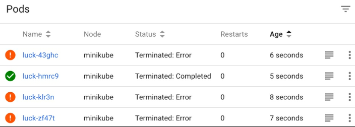
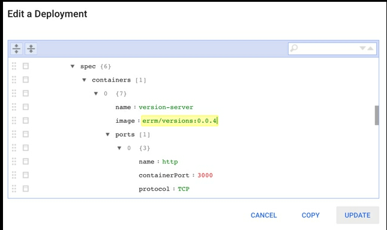

# 应用的管理变更
在第二章中，启动了引擎，我们首先看一下使用部署在Kubernetes上运行应用程序。 在本章中，我们将深入介绍Kubernetes提供的工具，以管理我们在集群上运行的pod。
- 我们将学习如何使用Job资源确保成功完成批处理任务。
- 我们将学习如何使用CronJob资源按计划的时间间隔运行作业。
- 最后，我们将学习如何使用部署来保持长期运行的应用程序，并在需要进行更改时更新它们或其配置。

我们将了解如何使用Kubernetes以不同方式启动pod，具体取决于我们运行的工作负载

您将学习更多关于如何使用部署资源来控制Kubernetes对长期运行的应用程序进行更改的方式。 您将了解使用Kubernetes执行常见部署模式的方法，例如蓝绿和金丝雀部署

根据设计，pods 本身不能长期运行的。 正如我们之前所讨论的，有一大堆条件可以导致pods终止运行。 他们包括：

- **底层节点的故障**：可能是由某些意外事件引起的，例如硬件故障。 或者也许是通过设计; 例如，在现有实例的集群中，系统对实例的要求暴涨（访问量激增），则可以在没有警告的情况下出现。[TODO:The failure of an underlying node: Perhaps caused by some unexpected event, such as a hardware failure. Or perhaps by design; for example in a cluster utilizing spot priced instances nodes can be terminated without warning if demand for instances increases.]
- 调度程序实时启动的Pod：调度程序可以在需要时实时启动pod，以优化集群上资源的使用。 这可能是因为某些进程具有比其他进程更高的优先级，或者只是为了优化集群上的bin 打包。

- 用户手动删除Pod。

- 由于计划维护，pods 被移除; 例如，通过使用kubectl drain命令。

- 由于网络分区，该节点不再对群集可见。

- 从节点中删除Pod以准备缩小操作。

因此，如果Kubernetes的设计期望 pod 是短暂的，我们如何部署可靠的应用程序？ 当然，我们需要一些方法来运行我们的程序吗？ 值得庆幸的是，事实并非如此。 这种设计的重要部分在于，它可以准确地模拟由于底层硬件和软件以及管理过程导致的系统中可能出现的各种问题。 Kubernetes不是试图让原始构建块（pod）对故障本身具有弹性，而是提供了许多控制器，我们作为用户可以直接与之交互以构建弹性服务。 这些控制器处理由于各种原因而丢失的pod的替换。

这些控制器分为四组，我们的选择实际上取决于我们要运行的工作负载类型：

- 对于我们期望结束的流程，例如批处理作业或其他有限流程，Kubernetes提供了作业抽象。 作业确保pod至少运行一次完成。

- 对于我们期望长期运行的pod，例如Web服务器或后台处理工作程序，Kubernetes提供部署和较低级别的ReplicationController或ReplicaSet。

- 对于我们想要在所有机器（或其中一部分）上运行的pod，Kubernetes提供了DaemonSet。 DaemonSet通常用于提供构成平台一部分的计算机专用服务，例如日志管理或监视代理，通常用于部署覆盖网络的每个节点组件。

- 对于每个pod需要稳定身份或访问持久存储的pod组，Kubernetes提供StatefulSets。 （我们将在第9章“存储状态”中介绍StatefulSet。）

如果您回想一下我们在第1章中了解Kubernetes的体系结构，Google的基础设施以及其他人，重要的是要记住控制器管理器（运行所有这些控制器的Kubernetes微服务）是独立且独特的 来自调度程序的进程。 Kubernetes的核心低级部分（例如调度程序和kubelet）只知道pod，而更高级别的控制器不需要了解实际调度和在节点上运行pod的任何细节。 他们只是向API服务器发出请求以创建pod，而较低级别的机器确保它们被安排并正确运行。

在本章中，我们将介绍作业，部署和DaemonSet为我们提供的重要功能和配置选项。 通过一些示例，您将开始了解何时使用每个资源来部署应用程序。 您应该花时间了解每个控制器正在做什么以及为什么要使用它。

将软件部署到分布式环境起初可能有点不寻常，因为在将软件部署到单个计算机时，您可能对软件运行方式做出的许多假设可能无法在分布式系统中运行。

Kubernetes可以很好地部署大多数软件而无需任何修改。 我喜欢认为Kubernetes让我们交换一点简单性以获得很高的可靠性。

## 直接运行pods
Kubernetes并不打算让用户直接在群集上提交和启动pod。 正如我们之前讨论的那样，pod设计为短暂的，因此不适合运行工作负载，我们希望确保执行已完成或我们希望确保流程保持正常运行。

在这里，我们将从第一个原则开始，启动pod，然后继续使用控制器来帮助我们管理它们。 请记住，这是一个学习练习;如果您需要它们可靠地运行，则不应以这种方式提交pod：

```
pod.yaml
apiVersion: v1
kind: Pod
metadata:
  name: hello-loop
spec:
  containers:
  - name: loop
    image: alpine
    command: ["/bin/sh"]
    args:
    - -c
    - while true; do echo "hello world"; sleep 2s; done

```

这个pod启动一个无限循环，每2秒打印一次hello world。 首先使用kubectl将pod提交到集群：
``` bash
$ kubectl create -f pod.yaml
pod "hello-loop" created

```
在容器运行时下载映像时，可能需要一些时间来创建pod。 在发生这种情况时，您可以通过运行kubectl describe pod / hello-loop或使用仪表板来检查pod的状态。

Tips: 事实上Kubernetes可以通过API控制甚至最低级别的抽象，例如pod，这使得使用或构建附加功能扩展Kubernetes变得容易，这些附加工具可以像内置的一样强大控制器。

pod启动并运行后，您可以使用kubectl logs -f hello-loop跟随输出，您应该每2秒看一次hello world输出。

Tips: kubectl logs允许我们显示已在群集上运行的pod的日志。 如果您知道要从中获取日志的pod的名称，则可以将该名称作为参数传递。 但是，如果您使用控制器来启动窗格，则只需在名称前加上资源类型，就可以使用作业或部署的名称代替窗格名称。
如果您有感兴趣的pod或pod的标签选择器，则可以使用-l标志传递它们。 使用-c标志，您可以在具有多个容器的pod中定位特定的命名容器; 如果pod只有一个容器，则可以省略。
尝试运行 kubectl。 它可以帮助日志发现更多可用于查看您感兴趣的日志的选项，包括将它们限制在特定时间段内。

## Jobs
作业最简单的用例是启动单个pod并确保它成功运行完成。

在下一个示例中，我们将使用Ruby编程语言来计算和打印出前100个Fibonacci数：

```
fib.yaml
apiVersion: batch/v1
kind: Job
metadata:
  name: fib
spec:
  template:
     metadata:
       name: fib
     spec:
       containers:
       - name: fib
         image: ruby:alpine
         command: ["ruby"]
         args:
         - -e
         - |
           a,b = 0,1
           100.times { puts b = (a = a+b) - b }
       restartPolicy: Never 
```

请注意，spec和模板的内容与我们用于直接启动pod的规范非常相似。当我们定义要在作业中使用的pod模板时，我们需要选择_restartPolicy_ of _Never_或OnFailure。

这样做的原因是作业的最终目标是运行pod直到它成功退出。如果底层pod在成功退出时重新启动，则pod将继续重新启动并且作业永远不会完成。

将定义保存到文件，然后使用kubectl create将其提交到集群：

```
$ kubectl create -f fib.yaml
job "fib" created
```

一旦你向Kubernetes提交了一份工作，你就可以了
 可以使用kubectl describe命令检查其状态。 Docker镜像可能需要一段时间才能下载，而Kubernetes可能需要一段时间才能启动pod。当pod正在运行时，您应该在Pods Statues字段中首先看到1 Running，然后是1 Succeeded：

```
$ kubectl describe jobs/fib
Name: fib
Namespace: default
Selector: controller-uid=278fa785-9b86-11e7-b25b-080027e071f1
Labels: controller-uid=278fa785-9b86-11e7-b25b-080027e071f1
  job-name=fib
Annotations: <none>
Parallelism: 1
Completions: 1
Start Time: Sun, 17 Sep 2017 09:56:54 +0100
Pods Statuses: 0 Running / 1 Succeeded / 0 Failed 
```

提示：在等待Kubernetes采取某些行动时，反复运行kubectl以查明发生的事情会变得乏味。我喜欢将watch命令与kubectl结合使用。要观看Kubernetes推出这项工作，我可以运行：

```
 | $ watch kubectl describe jobs/fib
 ```


  大多数Linux发行版默认包含watch命令，或者使用包管理器安装简单。如果您使用的是macOS，使用Homebrew进行安装非常简单：

```
 $ brew install watch 
```
我们可以使用kubectl日志来查看作业的输出。请注意我们如何不需要知道底层pod的名称;我们可以通过名字来引用这份工作：

```
$ kubectl logs job/fib
...
83621143489848422977
135301852344706746049
218922995834555169026 
```

我们还可以通过使用Kubernetes为我们添加到pod中的作业名称标签来查看此作业使用kubectl获取创建的基础pod：

```
$ kubectl get pods -l job-name=fib --show-all
NAME READY STATUS RESTARTS AGE
fib-dg4zh 0/1 Completed 0 1m 
```

tips: --show-all标志表示显示所有pod（即使是那些不再具有运行状态的pod）。

请注意Kubernetes如何根据作业名称为我们的pod创建唯一名称。这很重要，因为如果创建的第一个pod以某种方式失败，Kubernetes将需要基于相同的pod规范启动另一个pod。

与直接启动pod相比，作业的关键优势之一是作业不仅能够处理由底层基础架构导致的错误，这些错误可能导致pod在完成之前丢失，还会处理运行时发生的错误。

为了说明这是如何工作的，这个作业模拟了一个过程（大部分）以非零退出状态失败，但有时以（成功）零退出状态退出。这个Ruby程序选择一个从0到10的随机整数并随之退出。因此，平均而言，Kubernetes必须在成功退出之前运行pod 10次：

```
luck.yaml
apiVersion: batch/v1
kind: Job
metadata:
  name: luck
spec:
  template:
    metadata:
      name: luck
    spec:
      containers:
      - name: luck
      image: ruby:alpine
      command: ["ruby"]
      args: ["-e", "exit rand(10)"]
restartPolicy: Never 
```

和以前一样，使用kubectl将作业提交到您的集群：

```
$ kubectl create -f luck.yaml
job "luck" created 
```

除非你很幸运，当你检查这份工作时，你应该看到Kubernetes在退出0状态之前必须启动一些pod：

_使用Kubernetes仪表板检查运气工作启动的吊舱_

在此示例中，pod规范具有NeverPolicy为Never。这意味着当pod以非零退出状态退出时，pod将被标记为已终止，并且作业控制器将启动另一个pod。也可以使用startFolicy的OnFailure运行作业。
## CronJob
现在您已经学习了如何使用作业运行一次性或批处理任务，扩展概念以运行预定作业非常简单。在Kubernetes中，CronJob是一个控制器，可以在给定的时间表上从模板创建新作业。

让我们从一个简单的例子开始。以下示例将每分钟启动一个作业。此作业将输出当前日期和时间，然后退出：

```sh
fun-with-cron.yaml
apiVersion: batch/v1beta1
kind: CronJob
metadata:
  name: fun-with-cron
spec:
  schedule: "* * * * *"
  jobTemplate:
    spec:
      template:
        metadata:
          labels:
            cronjob: fun-with-cron
        spec:
          restartPolicy: OnFailure
          containers:
          - name: how-soon-is-now
            image: alpine:3.6
            command: ["/bin/date"] 
```

使用kubectl将CronJob推送到Kubernetes：

```sh
$ kubectl apply -f fun-with-cron.yaml 
```
经过一段时间（不到一分钟），您应该看到创建的第一个 job：

```
$ kubectl get jobs
NAME DESIRED SUCCESSFUL AGE
fun-with-cron-1533475680 1 1 9s 
```
我们添加到pod模板规范的标签允许我们使用kubectl日志来查看CronJob创建的所有pod的输出：
```
$ kubectl logs -l cronjob=fun-with-cron
  Sun Aug 5 13:26:08 UTC 2018
  Sun Aug 5 13:27:08 UTC 2018
  Sun Aug 5 13:28:08 UTC 2018
```
### Cron 语法结构
schedule字段的语法遵循标准的Cron格式，如果您曾经在类Unix系统上设置过CronJobs，那么这应该很熟悉。 Kubernetes支持带有一些常见扩展的标准cron字符串。

标准cron字符串由五个字段组成，每个字段代表不同的时间单位。每个都可以设置为表示特定时间的表达式，或者每次都匹配的通配符（*）。例如，Months列中的通配符将与每个月匹配：

|------|------|------|------|------|
|Minutes|Hours|Day of Month|Month|Day of Week|
cron字段的顺序

如果从左到右读取cron格式，则最简单易懂。这里有些例子：


- 0 * * * *: On the hour, every hour 
- 15 * * * *: 15 minutes past every hour 
- 0 0 * * *: At midnight, every day 
- 30 5 1 * *: 5:30 a.m. on the first day of the month, every month 
- 30 17 * * 1: 15:30 p.m., every Monday 

除了通配符之外，还有一些具有特殊含义的其他字符。

斜杠用于表示步骤：

- 0/15 * * * *: Every 15 minutes, starting at 0; for example, 12:00, 12:15, 12:30, and so on 
- 15/15 * * * *: Every 15 minutes, starting at 15; for example, 12:15, 12:30, 12:45, 13:15, 13:30, and so on 
- 0 0 0/10 * *: Every 10 days at midnight 

连字符表示范围：

- 0 9-17 * * *: Once an hour during office hours (9 a.m. till 5 p.m.)
- 0 0 1-15/2 * *: Every other day for the first 15 days of every month 

逗号表示列表：

- 0 0 * * 6,0: Midnight on Saturday and Sunday 
- 0 9,12,17 * * 1-5: At 9:00 a.m., 12 noon, and 5:00 p.m., Monday to Friday 

为了提高可读性，可以在星期和星期几字段中使用名称：

- 0 0 * * SUN: Midnight on Sunday 
- 0 6 * MAR-MAY *: 6 a.m. every day in Spring 

如果您不介意何时运行一个作业，您可以指定一个固定的间隔，Kubernetes将以固定的间隔创建作业：

- @every 15m: Every 15 minutes 
- @every 1h30m: Every 1-and-a half hours 
- @every 12h: Every 12 hours 

请记住，间隔不会占用作业所需的时间;它只是确保每个作业的计划时间由给定的间隔分隔。

最后，有几个预定义的计划可以用作快捷方式代替cron字符串：

|------|------|------|
|@hourly|0 0 * * * *|Every hour, on the hour |
|@daily|0 0 0 * * *|Every day at midnight |
|@weekly|0 0 0 * * 0|Every week midnight on Sunday |
|@monthly|0 0 0 1 * *|Monthly, at midnight on the 1st |
|@yearly|0 0 0 1 1 *|Midnight, every New Year's Eve|

### 并发策略
与传统的CronJob相比，Kubernetes CronJob允许我们决定当工作超支并且在前一个工作仍在运行时达到预定时间时会发生什么。我们可以通过在CronJob上设置spec.concurrencyPolicy字段来控制此行为。我们可以选择三种可能的策略：

默认情况下，如果该字段未设置，则我们获取允许策略。这与传统的CronJob一样，允许多个作业实例同时运行。如果你坚持这一点，你应该确保你的工作确实在某个时候完成，或者你的集群最终可能会被同时运行的许多工作所淹没。

禁用策略可防止在现有作业仍在运行时启动任何新作业。这意味着如果工作超支，Kubernetes将跳过下一次运行。如果有两个或多个正在运行的作业实例可能导致冲突或耗尽共享资源，那么这是一个不错的选择。当然，你的工作确实需要能够解决在这种情况下缺失的运行。

最后，替换策略还会阻止多个作业立即运行，但它不是跳过运行，而是先杀死现有作业，然后启动新作业。
### 历史限制
默认情况下，当您使用CronJob时，它创建的作业将保持不变，因此您可以检查特定运行的作业发生了什么以进行调试或报告。 但是，您可能会发现，使用CronJob时，处于成功或失败状态的作业数量会迅速增加。 使用spec.successfulJobsHistoryLimit和spec.failedJobsHistoryLimit字段可以轻松管理。 成功或失败的作业达到限制中指定的数量后，每次创建新作业时都会删除最旧的作业。 如果将限制设置为0，则作业一完成就会被删除。
## 使用部署管理长时间运行的流程

更新批处理（例如作业和CronJobs）相对容易。由于它们的生命周期有限，因此更新代码或配置的最简单策略就是在再次使用之前更新相关资源。

长时间运行的进程有点难以处理，如果您将服务暴露给网络，则更难管理。 Kubernetes为我们提供了部署资源，以便进行部署，更重要的是，更简单地更新长时间运行的流程。

在第2章“启动引擎”中，我们首先了解了部署资源，包括使用kubectl运行创建部署以及在YAML文件中定义部署对象。在本章中，我们将回顾部署控制器用于推出更改的过程，然后查看一些更高级的选项，以准确控制新版本的pod的可用性。我们将介绍如何将部署与服务结合使用，以便在不停机的情况下对网络上提供的服务进行更改。

就像CronJob是作业的控制器一样，部署是ReplicaSet的控制器。 ReplicaSet确保特定配置所需的pod数量已启动并正在运行。为了管理对此配置的更改，部署控制器使用新配置创建新的ReplicaSet，然后根据特定策略将旧的ReplicaSet向下扩展并将新的ReplicaSet向上扩展。即使在完成新配置的部署之后，部署也将维护对旧ReplicaSet的引用。这允许部署还根据需要协调回滚到先前版本。


让我们从一个示例应用程序开始，该应用程序将允许您快速了解部署提供的不同选项如何允许您在更新代码或配置期间操纵应用程序的行为。

我们将部署一个我创建的应用程序，以便于说明使用Kubernetes部署新版本的软件。它是Docker存储库中的一个简单的Ruby Web应用程序，它具有许多版本标记。在浏览器中打开主页时，每个版本都会显示唯一的名称和颜色方案。

当我们将长期运行的流程部署到Kubernetes时，我们可以使用标签以受控方式推出对应用程序的访问。最简单的实施策略是使用单个部署将更改推广到新版本的应用程序。

要实现这一点，我们需要首先创建一个带有标签选择器的服务，该服务器将匹配我们现在或将来可能部署的每个应用程序版本：

```
service.yaml 
apiVersion: v1
kind: Service
metadata:
  name: ver
spec:
  selector:
    app: ver
  ports:
  - protocol: TCP
    port: 80
    targetPort: http 
```

在这种情况下，我们通过将具有与选择器匹配的标签的任何pod匹配为app：ver来实现此目的。

运行由多个部署管理的具有多个不同进程的更复杂的应用程序时，标签和选择器将需要更复杂。常见的模式是区分应用程序的组件部分和组件标签。

在启动任何pod之前提交服务定义是有意义的。这是因为如果可能，调度程序将尝试将特定服务使用的pod分布在多个节点上，以提高可靠性。

使用kubectl apply -f service.yaml将服务定义提交到集群。将服务提交到集群后，我们可以准备初始部署：

```
deployment.yaml
apiVersion: apps/v1
kind: Deployment
metadata:
  name: versions
  labels:
    app: ver
spec:
  replicas: 2
  selector:
    matchLabels:
      app: ver
  template:
    metadata:
      labels:
        app: ver
        version: 0.0.1
    spec:
      containers:
      - name: version-server
        image: errm/versions:0.0.1
        ports:
        - name: http
          containerPort: 3000 
```

要访问正在运行的服务，最简单的方法是使用kubectl打开集群上运行的Kubernetes API的代理：

$ kubectl代理
开始服务于127.0.0.1:8001

完成后，您应该可以使用浏览器在 http://localhost:8001/api/v1/namespaces/default/services/ver/proxy. 查看应用程序。

我们现在可以通过多种方式对部署进行更改。
### kubectl patch

要升级到版本0.0.2，我们将执行以下命令：

$ kubectl patch deployment/versions -p '
{"spec":{"template":{"spec":{"containers":[{"name":"version-server", "image":"errm/versions:0.0.2"}] }}}}' 
tips:因为容器是一个列表，我们需要为Kubernetes指定合并键名称，以了解我们想要更新图像字段的容器。

使用patch命令，Kubernetes执行合并，将提供的JSON与部署/版本对象的当前定义合并。

继续并在浏览器中重新加载应用程序，然后您应该注意（几秒钟后）应用程序的新版本可用。

### kubectl edit

要升级到版本0.0.3，我们将使用kubectl edit命令：

kubectl编辑部署/版本

tips:kubectl edit使用系统的标准编辑器编辑Kubernetes资源。 这通常是vi，vim甚至ed，但是如果你有另一个文本编辑器，你更喜欢你应该设置EDITOR环境变量来指向你喜欢的选择。

这应该打开您的编辑器，以便您可以更改部署。 发生这种情况后，编辑图像字段以使用版本0.0.3并保存文件。

tips: 您可能会注意到，编辑器中打开的对象中的字段数多于您提交给Kubernetes的原始文件。 这是因为Kubernetes正在存储有关此对象中部署的当前状态的元数据。


### kubectl apply

要更新到版本0.0.4，我们将使用apply命令。 这允许我们将完整资源提交给Kubernetes，就像我们进行初始部署一样。

首先编辑部署YAML文件，然后更新映像字段以使用版本0.0.4。 保存文件，然后使用kubectl将其提交给Kubernetes：
```
$ kubectl apply -f deployment.yaml
```
tips: 如果您使用kubectl申请尚不存在的资源，则会为您创建。 如果您在脚本部署中使用它，这将非常有用。

  使用kubectl而不是编辑或修补程序的优点是，您可以将文件检入版本控制以表示群集的状态。

### Kubernetes dashboard

Kubernetes仪表板包含一个基于树的编辑器，允许您直接在浏览器中编辑资源。在Minikube上，您可以运行Minikube仪表板以在浏览器中打开仪表板。然后，您可以选择部署并单击页面顶部的编辑按钮：

您应该能够通过滚动或搜索功能找到容器图像字段。单击一个值进行编辑很简单，然后按UPDATE。

在了解Kubernetes并尝试不同配置的同时，用于更新配置的方法应该是您个人的偏好。使用Kubernetes仪表板或kubectl edit等工具非常适合学习和调试。但是当您前进到生产环境时，您将需要将配置检查到版本控制，或使用Helm等工具（我们将在第5章使用Helm管理复杂应用程序中讨论）。

### 更好地控制您的部署

到目前为止，我们已经介绍了一些可以更新Kubernetes资源的方法。正如我们所观察到的，当我们更新Kubernetes中的部署时，最终会更新群集中的pod以反映新配置。

Kubernetes通过在幕后管理ReplicaSet来实现这一目标。

ReplicaSet完全关注管理一组pod，以确保在群集上运行所需数量的副本。在更新期间，永远不会更改现有ReplicaSet的pod规范。部署控制器使用新的pod配置创建新的ReplicaSet。通过更改每个ReplicaSet所需的副本数量来编排此新配置的部署。

这种关注点分离是Kubernetes设计资源的典型方式。通过编排更简单的对象来实现更复杂的行为，其控制器实现更简单的行为。

这种设计也使我们（集群运营商）在更新配置时确切地确定了我们想要的行为。 spec.stratergy字段用于配置更改推出时使用的行为。

.spec.strategy.type字段定义用于将旧容器替换为新容器的策略。目前，有两种策略：重新创建和RollingUpdate。 RollingUpdate是默认策略，因此通常您不需要在配置中指定它。

### 回滚部署你的操作

 _.spec.strategy.type = RollingUpdate_ 是默认策略。这是我们迄今为止在我们的示例中使用的策略。

只要您想在不中断服务的情况下进行更新，您就会专门选择滚动更新。相反，如果您使用此策略，则当多个版本同时运行时，您的应用程序必须正常工作。

使用 _RollingUpdate_ 策略时，有两个设置允许我们指定新 _ReplicaSet_ 的扩展速度以及旧 _ReplicaSet_ 按比例缩小的速度：

 -  _.spec.strategy.rollingUpdate.maxUnavailable_：它指定在部署过程中可用的pod数（超出所需总数）
 -  _.spec.strategy.rollingUpdate.maxSurge_：它指定在部署过程中可以创建超过所需总数的pod数

这些设置接受绝对值，例如1或0，或部署中所需的总pod数的百分比。如果您希望此配置可以跨不同级别扩展到不同级别，或者您打算使用自动扩展机制控制所需数量的pod，则百分比值非常有用。

通过将 maxUnavailable 设置为0，Kubernetes 将等待直到替换pod已经安排并且正在运行，然后杀死由旧 ReplicationSet 管理的任何pod。如果以这种方式使用maxUnavailable，那么在部署过程中，Kubernetes 将运行超过所需数量的 pod，因此maxSurge不能为0，并且您必须具有所需的资源（在群集中，并且对于支持服务）才能暂时支持在部署阶段运行额外的实例。

一旦Kubernetes启动了所有实例，它必须等到新 pod 处于服务状态并处于 Ready 状态。这意味着如果您已为pod设置了运行状况检查，则部署将在这些检查失败时暂停。

如果将 _maxSurge_ 和/或 _maxUnavailable_ 设置为较低值，则部署将花费更长时间，因为部署将暂停并等待新的pod在继续之前变为可用。这可能很有用，因为它为您提供了一定程度的保护，以防止部署损坏的代码或配置。

将maxSurge设置为更大的值将减少部署更新应用程序所需的扩展步骤数。例如，如果您将maxSurge设置为100％并将maxUnavailable设置为0，则Kubernetes会在部署开始时立即创建所有替换窗格，并在新窗格进入Ready状态时终止现有窗格。

具体如何配置部署取决于应用程序的要求和群集可用的资源。

您应该记住，将maxSurge设置为较低的值会使您需要较长时间才能完成较慢的部署，但可能更容易出错，而使用更高的maxSurge值，您的部署将更快地进行。但是，您的群集需要具有足够的容量来支持其他正在运行的实例。如果您的应用程序访问其他服务，您还应该知道可能对它们施加的额外负载。例如，可以将数据库配置为对其接受的连接数量进行限制。
### 重新部署
 _.spec.strategy.type=Recreate_ 采用更简单的方法来推出对应用程序的更改。 首先，通过缩小活动ReplicaSet来终止具有先前配置的所有pod，然后创建一个新的ReplicaSet以启动替换pod。

当您不介意短时间停机时，此策略尤其适用。 例如，通过后台处理，当工作人员或其他任务不需要提供通过网络访问的服务时。 这些用例的优点是双重的。 首先，您不必担心由同时运行的两个版本的代码导致的任何不兼容性。 其次，当然，使用此策略更新pod的过程不再使用应用程序通常需要的资源。
## DaemonSet 守护进程集
如果希望在群集的每个节点（或节点的子集）上运行特定pod的单个实例，则需要使用DaemonSet。当您将DaemonSet安排到群集时，您的pod的实例将被安排到每个节点，当您添加新节点时，也会在那里安排Pod。 DaemonSet对于提供需要在群集中的任何位置都可用的无处不在的服务非常有用。您可以使用DaemonSet提供以下服务：

 - 用于摄取和发送日志的代理，例如Fluentd或Logstash
 - 监视代理程序，例如collectd，Prometheus Node Exporter，datadog，NewRelic或SysDig，等等
 - 分布式存储系统的守护程序，例如Gluster或Ceph
 - 用于覆盖网络的组件，例如Calico或Flannel
 - 每个节点组件，虚拟化工具，如OpenStack

在Kubernetes之前，这些类型的服务需要您在基础结构中的每台服务器上配置init系统，例如systemd或SysVnit。当您更新服务或其配置时，您必须更新该配置并在所有服务器上重新启动服务，这在您管理一些服务器时有问题，但是有数十，数百甚至数千台服务器事情很快变得难以管理。

通过DaemonSet，您可以使用与我们在基础架构上运行的应用程序完全相同的配置和容器化来管理基础架构本身。

让我们看一个简单的例子来理解我们如何为一个有用的目的创建一个DaemonSet。我们将部署Prometheus节点导出器。此应用程序的目的是公开一个HTTP端点，其中包含有关运行它的Linux系统的指标。

tips:Exporter是一个非常有用的工具。如果您决定在自己的群集中运行它，我建议您查看GitHub页面上提供的大量文档，网址为https://github.com/prometheus/node_exporter。此清单会导致模板部分中指定的pod安排到群集中的每个节点：

node-exporter.yaml 
apiVersion: apps/v1 
kind: DaemonSet 
metadata: 
  labels: 
    app: node-exporter 
  name: node-exporter 
spec: 
  selector: 
    matchLabels: 
      app: node-exporter 
  template: 
    metadata: 
      labels: 
        app: node-exporter 
    spec: 
      containers: 
      - name: node-exporter 
        image: quay.io/prometheus/node-exporter:v0.15.2 
        args: 
        - --path.procfs=/host/proc 
        - --path.sysfs=/host/sys
       volumeMounts: 
        - mountPath: /host/proc 
          name: proc 
          readOnly: false 
        - mountPath: /host/sys 
          name: sys 
          readOnly: false 
        ports: 
        - containerPort: 9100 
          hostPort: 9100 
      hostNetwork: true 
      hostPID: true 
      volumes: 
      - hostPath: 
          path: /proc 
        name: proc 
      - hostPath: 
          path: /sys 
        name: sys

为Node Exporter准备清单文件后，通过运行kubectl apply -f node-exporter.yaml 命令将其提交给 Kubernetes。


您可以通过运行kubectl describe ds / node-exporter命令来检查DaemonSet控制器是否已正确地将我们的pod安排到集群中的节点。假设pod成功运行，您应该能够对其中一个节点上的端口9100发出HTTP请求，以查看它公开的度量标准。

tips:如果您在Minikube上尝试此示例，则可以通过运行minikube ip来发现群集中（唯一）节点的IP地址。
然后，您可以使用curl等工具发出请求：
$ curl 192.168.99.100:9100/metrics

使用DaemonSet管理基础架构工具和组件，而不是依靠节点上的静态配置来管理它们，其中一个关键优势是，它们可以像在群集上运行的任何其他应用程序一样轻松地进行更新。

默认情况下，DaemonSet具有RollingUpdate的updateStrategy。这意味着如果您在DaemonSet中编辑pod模板，则会终止当前在群集上运行的现有pod，并逐个替换。

让我们尝试使用此功能升级到更新版本的Prometheus节点导出器：

```
kubectl set image ds / node-exporter node-exporter = quay.io / prometheus / node-exporter：v0.16.0
```
您可以通过运行以下命令检查使用新版本替换旧容器的进度：kubectl rollout status ds / node-exporter命令。更新完成后，您应该看到以下消息：守护程序集“node-exporter”已成功推出。

tips:您可能想知道其他updateStrategys可用于DaemonSet。唯一的另一个选择是OnDelete。使用此选项，当更新DaemonSet时，不会对群集上运行的正在运行的pod进行任何更改，而是由您在启动新版本之前手动删除正在运行的Pod。这主要是为了提供与先前版本的Kubernetes中的行为的兼容性，并且在实践中不是非常有用的。

值得注意的是，为了使用DaemonSet推出新版本的pod，旧的pod被杀死和新的pod正在启动之间会有一段短暂的时间，在此期间您运行的服务将是不可用。

DaemonSet还可用于在群集中的节点子集上运行pod。这是通过标记集群中的节点并将nodeSelector添加到DaemonSet的pod规范来实现的：

... 
    spec: 
      nodeSelector: 
        monitoring: prometheus 
      containers:
      - name: node-exporter
...

编辑清单以添加nodeSelector后，使用以下命令将新配置提交到Kubernetes：kubectl apply -f node-exporter.yaml。

您应该注意到正在运行的节点导出器窗格终止并从群集中删除。这是因为群集中没有节点与我们添加到DaemonSet的标签选择器匹配。可以使用kubectl动态标记节点：

```
kubectl label node/<node name> monitoring=prometheus      
```

一旦节点被正确标记，您应该注意到DaemonSet控制器为其安排了一个pod。

tips:在AWS上，节点会自动标记包含区域，可用区，实例类型和主机名的信息。您可能希望使用这些标签将服务部署到群集中的某些节点，或者为群集中的不同类型的节点提供不同配置的工具版本。
如果要添加其他标签，可以使用--node-labels标志将它们作为参数传递给kubelet。
## 小结

在本章中，我们学习了如何使用Kubernetes来运行我们的应用程序，更重要的是，如何推出新版本的应用程序及其配置。

我们基于前面章节中对pod和部署的基本知识：

 -  Pod是Kubernetes为我们提供的最低级别的抽象
 - 处理运行容器的所有其他资源（例如作业，ScheduledJobs，部署甚至DaemonSet）都通过以特定方式创建容器来工作。
 - 通常，我们不想直接创建pod，因为如果pod正在运行的节点停止工作，那么pod也是如此。使用其中一个更高级别的控制器可确保创建新的pod以替换故障的pod。
 - 更高级别的资源（例如部署和DaemonSet）提供了一种机制，以受控方式将一个版本的pod替换为另一个版本。我们了解了可用于执行此操作的不同策略。

在继续下一章之前，请花些时间通过观察部署策略在部署过程中的行为来了解每种部署策略的工作原理。通过一点经验，您将了解为给定应用程序选择哪些选项。

在下一章中，我们将讨论使用基于这些概念的工具，以提供更强大的方法来部署和更新您的应用程序。