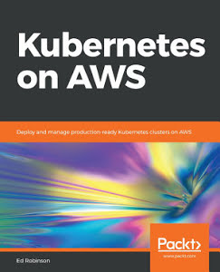

# 介绍

本书来自于《Kubernetes on aws》2018-11版 作者2018

# 目标

在 aws 上部署和管理预生产集群。

# 关于作者

Ed Robinson（罗宾逊）是Cookpad位于英国布里斯托尔的全球总部的高级工程师。过去三年来，他一直与
Kubernetes合作，在AWS上部署集群，为全球受众提供灵活可靠的服务。他是几个开源项目的贡献者，并
且是Træfik的维护者，Træfik是为容器和微服务设计的现代HTTP反向代理。

# 书评人
Manuel Tiago Pereira是一名软件工程师，在从开发环境到高可用性Web平台应用程序的系统自动化基础架构配置和配置方面拥有丰富的经验。在过去的几年里，他一直致力于为使用Kubernetes的应用程序部署提供可靠的平台。他的大部分职业生涯都致力于SaaS公司，他目前在Talkdesk工作，以使呼叫中心运营商的生活更轻松，并提高客户的幸福感。