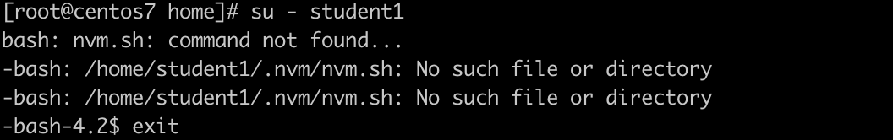

title: add_users_by_bash
author: Denlly <fan91163@gmail.com>

# 批量增加用户


## 基本思路

*  创建一个用于存放 **用户名** 的txt文件
* 按照系统 */etc/passwd*  存放的文件格式填充到txt文件中
* 使用 **newusers** 命令导入到系统
* 创建用户的密码chpasswd

## 步骤

### step 1 查找一下 */etc/passwd* 的格式

``` 
# tail -l /etc/passwd

user:x:1000:1000:user:/home/user:/bin/bash
denlly:x:1001:1001::/home/denlly:/bin/bash

```

### step 2 创建一个 addusers.txt

```
# vim addusers.txt

student1::1011:1011:user:/home/student1:/bin/bash
student2::1012:1012:user:/home/student2:/bin/bash
student3::1013:1013:user:/home/student3:/bin/bash
student4::1014:1014:user:/home/student4:/bin/bash
student5::1015:1015:user:/home/student5:/bin/bash
student6::1016:1016:user:/home/student6:/bin/bash
student7::1017:1017:user:/home/student7:/bin/bash
student8::1018:1018:user:/home/student8:/bin/bash
student9::1019:1019:user:/home/student9:/bin/bash

```

编辑完成后保存

### step 3 root身份运行newusers

``` 
# newusers < addusers.txt
// 导入成功后检查是否导入
#  tail /etc/passwd


```

### step 4 创建密码并且修改密码

``` bash

pwunconv

vim passwords.txt
student1:123456
student2:123456
student3:123456
student4:123456
student5:123456
student6:123456
student7:123456
student8:123456
student9:123456

chpasswd < passwords.txt

pwconv

```

验证用户是否可以正常使用

``` bash
# su - student1
```
效果如下图
)

上图最后一行表示没有找到模板文件

### step5 拷贝用户的模板文件

``` bash
cp -rf .bash* .mozilla/ /home/student1
cp -rf .bash* .mozilla/ /home/student2
cp -rf .bash* .mozilla/ /home/student3
cp -rf .bash* .mozilla/ /home/student4
cp -rf .bash* .mozilla/ /home/student5
cp -rf .bash* .mozilla/ /home/student6
cp -rf .bash* .mozilla/ /home/student7
cp -rf .bash* .mozilla/ /home/student8
cp -rf .bash* .mozilla/ /home/student9
``` 

## 总结

通过使用最简单的 **txt** 文本文件将用户和密码导入系统提高了运维效率，如果采用 shell 脚本批量操作，甚好 🇨🇳，当然是否采用 shell 脚本导入，还是取决于这个操作的频繁度。如果维护的频繁度较低，建议用此工具导入。

## 参考